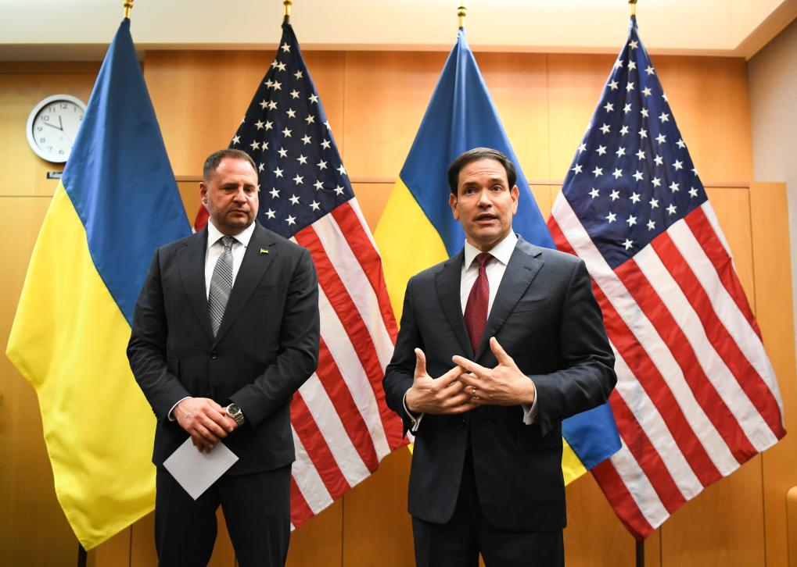
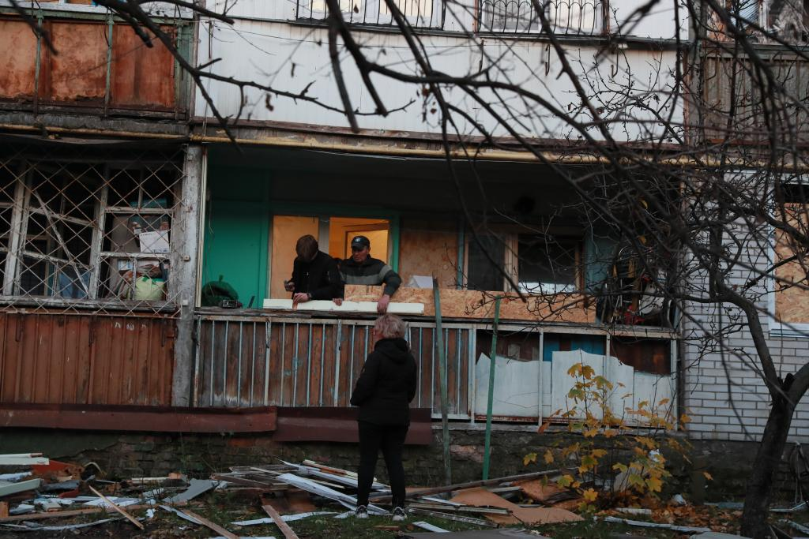

# 国际观察丨“28点新计划”变“19点”，美乌版方案改了哪些

> 📅 **爬取时间**: 2025-12-08 13:23:18
> 🔗 **来源链接**: http://www.news.cn/world/20251125/9129701c050e4549baff6d798d29857a/c.html
> 📆 **发布时间**: 2025-11-25
> 🎯 **爬取方式**: 静态爬取

---

新华社莫斯科11月25日电 **题：“28点新计划”变“19点”，美乌版方案改了哪些**

新华社记者栾海 侯鸣 孙萍

多家美国媒体24日报道，美国和乌克兰23日在瑞士日内瓦举行会谈，将美方就结束乌克兰危机所提28点新计划修改并缩减为19点，一些关键、更具争议的内容将留待美乌两国总统决定。

从28点到19点，美乌版方案做了哪些修改？

分析人士指出，美乌版方案修改之处，恰恰也会是俄乌双方的关键分歧所在。美方先前的28点计划被认为有利于俄罗斯立场，遭到乌克兰和欧洲国家反对；新方案则相对靠近乌方立场，俄方恐难以接受。目前俄乌战局僵持，俄乌美欧四方博弈仍将持续。

** 改了哪些内容**

根据白宫24日发布的一份美乌联合声明，双方在日内瓦会谈中起草了一份更新版方案。但美乌都没有公布新方案的具体内容。

11月23日，在瑞士日内瓦美国常驻联合国日内瓦办事处代表团驻地，美国国务卿鲁比奥（右）在记者会上发言。新华社记者连漪摄

据美国广播公司等多家美媒报道，修改后的方案并未对乌军规模作出严格限制，而先前的28点计划中将乌军规模限制在60万人以内。此外，新方案不再包含特赦俄乌冲突中“战争罪行”，而有关领土划分、乌克兰能否加入欧盟和北约以及对乌安全保障等议题被搁置。

彭博社援引乌方官员的话报道说，乌美双方并未排除乌克兰未来加入北约的可能性，这可能成为乌获得安全保障的条款之一。

乌克兰第一副外长谢尔盖·克斯利齐亚在日内瓦会谈后对媒体说，经过艰难谈判，双方在一些问题上达成一致，但有关领土划分、乌方能否加入北约等“最具争议”的内容留待乌美总统决定。

美国国务卿鲁比奥23日表示，对在一个“非常合理的时间框架内”达成协议感到乐观，但拒绝披露会谈细节。乌总统泽连斯基24日晚表示，修改后的计划是通往和平的“真正正确道路”，他将与特朗普讨论其中的敏感条款。

针对新版方案，欧盟和欧洲多国领导人指出，欧洲和乌克兰必须在制定和平协议的过程中发挥作用。德国总理默茨强调，乌克兰主权“绝不能成为任何协议的牺牲品”，欧洲人必须在“影响欧洲利益和主权的问题”上“说了算”。

分析人士认为，初版28点计划中较多内容符合俄方要求，修改后的方案减少了部分对乌方不利条款，使其向乌方立场相对有所靠近。美国《华盛顿邮报》援引乌方官员的话报道说，新方案中的措辞并非乌方“可全部接受”，但其文本经修改后乌方“至少还可以考虑”，而之前的方案更像是一份“最后通牒”。

** 计划前景如何**

目前，俄罗斯尚未对修改后的19点计划作出明确表态。俄总统新闻秘书佩斯科夫24日表示，俄方尚未收到新方案。俄总统助理乌沙科夫同日表示，目前关于和平方案有很多猜测，俄方只相信直接从美国方面获得的信息。

俄政治评论员尤里·斯韦托夫认为，19点计划是美乌协调后的方案，包含一些俄方无法接受的条款，更像是俄乌停火谈判的筹码和对俄施压的手段。

11月14日，在乌克兰首都基辅市第聂伯区，当地居民对遭受空袭损毁的房屋进行修缮加固。当天凌晨，基辅遭到俄军大规模空袭。新华社记者李东旭摄

《华盛顿邮报》报道分析说，各方就和平协议方案展开谈判对表可能需要数月甚至长达一年时间。

中国国际问题研究院欧亚研究所副所长韩璐表示，俄乌间的最大分歧仍在于领土划分和安全保障问题。俄方要求将整个顿巴斯（主要包括顿涅茨克和卢甘斯克两个地区）归俄方所有，但目前顿涅茨克地区还有部分领土尚未被俄军控制，乌方要求以接触线为基础进行谈判。在安全保障问题上，乌方希望西方国家派兵进入乌克兰参与维和，俄罗斯则坚决反对西方部队出现在乌克兰。

从施压乌方作出妥协，到邀请俄总统普京访美，再到取消与普京在欧洲会晤，现又提出不同版本的冲突解决方案……特朗普政府在俄乌冲突问题上立场左右摇摆、反复调整，缺乏明晰的解决路径。

分析人士认为，特朗普政府当下着眼点是为明年中期选举争取外交成绩，其目标是促成俄乌尽快停火、冻结冲突，而非彻底消除冲突根源。

---

*本文由 Creeper 自动爬取并清洗*