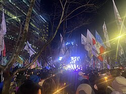

# 2024年韩国戒严 - 维基百科，自由的百科全书

> 📅 **爬取时间**: 2025-12-08 12:13:47
> 🔗 **来源链接**: https://zh.wikipedia.org/zh-hans/2024年韓國戒嚴
> 📆 **发布时间**: 2024-12-03
> 🎯 **爬取方式**: 动态渲染

---

# 2024年韩国戒严[编辑]

| 2024年韩国戒严 | |||
|---|---|---|---|
| 2024–2025年韩国政治危机的一部分 | |||
 韩国民众在国会议事堂邻近的道路阻挡戒严部队军车进入 | |||
| 日期 | 2024年12月3日22时27分 – 4日4时30分（约6小时） | ||
| 地点 | |||
| 起因 | |||
| 目标 | 透过戒严令发动自我政变[3]
| ||
| 结果 |
| ||
| 冲突方 | |||
| 领导人物 | |||
| 涉及单位 | |||
| 人数 | |||
| |||
| 伤亡 | |||
|

| ||
|---|---|---|
总统（2022年至2025年）
媒体库 |
||

2024年12月3日22时许，时任韩国总统尹锡悦在首尔发表紧急电视谈话，表示以共同民主党为首的国会反对党为“亲北韩势力”并透过“反国家活动”瘫痪政府，据此宣布全国戒严[7][2]。此次戒严因发生于12月3日，也被称为**一二·三紧急戒严事态**[8]（韩语：12.3 사태／12.3事態[9]）或**“12·3”紧急戒严**[10]（韩语：12.3 비상계엄／12.3 非常戒嚴?），是一次未遂的**自我政变**。本次戒严为自1980年全斗焕发动5·17政变，建立第五共和国军事独裁以来，韩国首次宣布戒严。[11]戒严令生效后，当局在国会议事堂部署军队，阻止国会议员进入，并与示威者发生冲突。军队甚至一度进入大楼内，试图逮捕议员。

事件引发韩国国内强烈反应，包括执政党国民力量、反对党共同民主党及各工会组织均反对戒严令，大批民众发动抗议并阻挡戒严部队进入国会。12月4日凌晨1时左右，韩国国会召开会议，当时已进入国会议事堂的190名议员全票通过决议，宣布总统颁布之戒严无效；当中172名议员为反对党议员、18名议员为执政党国民力量议员[12]。国会投票结束后，总统尹锡悦宣布将解除戒严令，但国防部长金龙显称戒严令将继续生效直至总统正式解除[13]。同日4时27分，尹锡悦发表公开演说，宣布将召开内阁会议并解除戒严令，但因时间正处凌晨，无法以法定人数召开内阁会议，故戒严令未能立即解除[14][15]。4时30分，韩国国务会议（内阁）通过解除戒严令，随后戒严司令部解散，戒严部队撤回原驻地[1]。

事件随即引发一连串的政治危机。韩国总统室首席秘书、室长等高级幕僚陆续提出辞职。12月4日下午，6个在野党联合向国会提交弹劾尹锡悦动议，同月6日至7日投票表决，但第一次则未通过；参与戒严的国防部长金龙显亦被在野党发起弹劾，随后自行辞职[16]。12月5日，据传尹锡悦将在当日再次发表公开谈话[17]，但其后总统室宣布他并未排入此行程[18]。12月7日，尹锡悦终出面对国民道歉，并强调不会二度戒严[19]。后续在同月14日的第二次动议中，被多数议员投票弹劾，并送至宪法法院审议。[20]

2025年1月9日，韩国宪法法院事务处长金正元表示，紧急戒严时颁布的戒严布告令不符合韩国宪法[21]。1月15日，韩国高级公职人员犯罪调查处在第二次拘捕行动中正式逮捕尹锡悦。[22]经逮捕必要性审查，首尔西部地方法院法官车恩京正式对尹锡悦进行签发逮捕令[23]。之后宪法法院举行一共11场庭审辩论，最终宪法法院在4月4日裁定尹锡悦违宪、解除其总统职务，尹锡悦成为继朴槿惠后第二位被弹劾下台的韩国总统。

## 背景

[编辑]

### 政治情况

[编辑]2022年5月，韩国保守派政党国民力量的总统候选人尹锡悦在选举中当选，以0.7%的优势，击败在野党共同民主党魁李在明，是韩国自1987年直选总统以来，胜选优势最少的一次。尹锡悦上任之后民望一直低迷，连串丑闻令民望不断受挫，11月的民调甚至寻底至17％。其妻子、第一夫人金建希一直面临受贿、操控市场、干政等指控。[24][25]

2024年大韩民国国会选举中，执政党国民力量惨败于进步派的共同民主党，维持执政以来“朝小野大”的局面[26]。在戒严事件发生的同一周，反对党透过议员比例优势，先后大幅削减了政府及执政党提出的预算请求，并且著手弹劾政府内阁官员[1]。自尹锡悦上任以来，在野党已发动22次对政府机关首长的弹劾案[27]，其中10次弹劾案是在2024年国会选举结束后发起[28]，弹劾对象包括监查院院长崔载海[29]。

### 早期计画

[编辑]在检方质询过程中，前国军防谍司令吕寅兄陆军中将作证称，尹锡悦总统于2023年12月下旬首次提出采取“紧急措施”解决“棘手社会问题”，吕中将认为这指向流产的戒严计划。2024年3月底，尹锡悦邀请时任国防部长申源湜、国家情报院长赵太庸、总统警卫处长金龙显共进晚餐，席间明确表示将“于近期颁布戒严令”。申源湜和赵太庸当场表示反对。因担忧戒严实施问题，申部长在晚宴结束后立即私下致电金龙显处长与时任反间谍司令吕寅兄，商讨如何阻止此类行动。[30]吕中将补充道，在2024年4月国会选举国民力量党惨败后，尹锡悦提及戒严令的频率显著增加。[31]最终申源湜被调离国防部长职位转任国家安保室长，而金龙显于2024年9月接任防长。

2024年12月27日公开的金龙显起诉书披露，自2024年3月起尹锡悦总统与前防长金龙显、司令官吕寅兄等人举行了约10次会议，核心议题均为实施戒严令。检方调查显示，这些会晤中反复讨论通过戒严手段镇压反政府集会、控制国民议会等具体方案。[32]

### 南北边境事件

[编辑]2024年5月，朝鲜开始向韩国投放装载垃圾的气球，以回应韩国组织“自由北韩运动联合”向北方散发的宣传气球。[33]同年10月，朝鲜指控韩国军方在平壤上空投放宣传传单无人机，韩国军方表示无法确认此事。[34]

12月，韩国国会国防委员朴范界援引军方消息人士称，国防部长金龙显策划了无人机事件以激化南北紧张局势[35][36][来源可靠？]，并指国军防谍司令部直接参与该事件。[37][需要完整来源][38]情报委员李基贤表示已证实金龙显曾命令联合参谋本部议长金明秀海军上将“对朝鲜飘来的粪便气球发射警告射击后实施源头打击”，但联参发言人予以否认。[39]李基贤称尹锡悦总统与金龙显试图通过制造“局部战争”为戒严令铺路。金明秀上将拒绝执行命令后遭金龙显辱骂，李基贤推测这导致金龙显改任陆军参谋总长朴安洙为戒严司令官，按惯例此职本应由金明秀担任。[40]

在12月1日（宣布戒严前两日），韩军召集上校级指挥官戒备“朝鲜即将发动的挑衅”，国军防谍司令吕寅兄下令准备应对“严重的朝鲜粪便气球事态”。[41]

警方调查戒严令期间，在安山市前国军情报司令部长卢相元（预备役陆军少将）住宅笔记本中发现备忘录，详细记载了通过在北方界线制造事端激怒朝鲜的计划。[42]2025年2月14日，《韩民族日报》披露该笔记本还载有拘押约500名公众人物、废除总统任期限制以使尹锡悦可连任三届的密谋。[43]

### 戒严疑云

[编辑]1961年5月，朴正熙发动五一六军事政变，废止宪法，以军政府取代第二共和国。朴正熙政府主导韩国历史上首次全文修宪。第三共和国宪法于1962年12月立法并生效[44]:82,88。自此，《大韩民国宪法》即有明定、授权总统宣布戒严的条款，经少量修改，沿用至今。

现行的韩国宪法最后一次修改于1987年10月[44]:88。宪法第77条授权韩国总统在战争、事变等紧急情况下宣布戒严（第1款），惟须立即通知国会（第4款）。宣布紧急戒严（비상계엄／非常戒嚴 bisang gyeeom）时，可取消对搜查令的要求，并管制言论、出版、集会、结社自由，及政府、法院的行政、司法权（第3款）。国会过半数议员要求解除戒严时，须解除戒严（第5款）。[45][44]:92

最后一次全文修改于2011年6月的韩国《戒严法》授权总统在战争、事变等国家紧急状况下，与敌人处于交战状态，或社会秩序受到严重扰乱，行政及司法职能难以履行时，宣布紧急戒严，惟须经国务会议（即内阁）审议（第2条），且须立即通知国会[44]:95。若国会处于休会期间，总统须立即要求国会召开会议（第4条）。总统宣布戒严时，须宣布戒严的理由、种类、实施时间、实施地区及戒严司令官（第3条）。国家状况恢复正常或国会要求解除戒严时，总统须经国务会议审议，立即解除戒严并宣布（第11条）。戒严期间，国会议员除非现行犯罪，不得被逮捕或拘留（第13条）。[46]

尹锡悦在2022年上任后，迅速任命了7名高级将领，包括联合参谋本部议长及陆海空三军的参谋总长[47]。同年，他任命了冲岩高等学校时的校友李祥敏为行政安全部部长[48]。2023年11月7日，尹锡悦任命又一位高中校友吕寅兄担任国军防谍司令部[注 1]司令[49]。2024年8月12日，尹锡悦提名时任总统警卫处长、又一位高中校友金龙显为新任国防部长[50][51]。之后，金龙显邀请首防司、特战司与防谍司令在汉南洞官邸会面[52]。种种巧合使共同民主党等在野党的议员怀疑尹政府可能实施戒严令[53][52]，其中领头的是共同民主党骨干金民锡；他还将金龙显类比经历相似的车智澈[注 2][53]。对此，总统府反驳称这是纳粹式的煽动[52]，国防部及执政党国民力量称其为政治煽动[54]。尽管承受怀疑，金民锡于9月20日的国会上，引用知名电影《首尔之春》，提出了“首尔之春4法”，希望修法以保障国会议员权利，避免戒严被滥用[55]。

## 发展

[编辑]### 部队动员

[编辑]2024年12月2日，在戒严实施的前一天，第707特殊任务团等部队接到命令，取消所有原定的户外训练，改为在驻地待命。12月3日，第707特殊任务团原定的联合演习及战术评估取消，改为专注于检查出动装备等部署准备工作[57][58][59]。12月3日下午，韩国国防部长金龙显主持召开全军主要指挥官会议，并指示全军加强戒备；有消息人士透露金龙显建议韩国总统尹锡悦实施戒严[60]。

韩国时间17时00分，隶属于韩国陆军特战司令部的特种部队，包括第707特殊任务团及第13特殊任务旅，接到命令为在孤立区域的活动做准备。一名不愿透露姓名的军事官员报告称，当时朝鲜军队并没有任何动向，而特种部队正是接受过针对这种情况的训练。[61][62]

18时20分，韩国国家警察厅长赵志浩接到来自总统办公室的命令要求“保持待命”。在12月5日国会的一次委员会质询中，赵厅长表示，在戒严计划公布前，他对此毫不知情[63]。20时左右，第707特殊任务团成员陆续收到出动通知与待命命令之简讯，内容指在北韩威胁下局势严峻，可能需要立即部署，在实际作战中可能需要乘坐直升机执行任务。情况十分严峻，在本周或下周有可能需要实地出动，请随时做好准备。士兵须确保子弹等装备可随时使用，国防部会优先考虑调派第707特殊任务团执行任务。[64][65][66]

共同民主党议员兼前国家情报院副院长朴善源引述多名曾参与戒严的士兵报告，许多士兵在任务执行前被告知是因“北韩相关紧急情况”而被召集，误以为出动任务与“北韩相关威胁”有关，但当天深夜登上直升机前才知道要前往国会，实际与北韩无关，并对此感到惊慌[65][67]。朴善源指军队指挥部欺骗第一线队员，弄得像他们要投入与北韩有关的行动[67]。朴善源表示由于有事前准备，策划缜密，戒严部队在宣布戒严后仅1小时便乘坐直升机抵达国会。[58]

指挥部对各单位下达了系统性的命令，按单位分工制定了高度组织化的计画。第707特殊任务团负责进入国会逮捕核心人物，及解散、驱散全体会议。行动期间，第1空降特战旅在第707特殊任务团进入国会时负责外围警戒任务，第3空降特战旅负责保卫京畿道果川市B-1地下掩体的韩国戒严指挥所，特战司令部特种作战航空团利用UH-60黑鹰直升机进行兵力运输，首都防卫司令部军事警察特殊任务队作为预备队，或负责扣押重要人物。[57][59][68]

21时50分，各大广播电视台收到一条信息称“即将有政府紧急公告，请连线直播”。然而，负责报道总统办公室的记者却被禁止进入新闻发布室。[69]

### 宣布戒严

[编辑]| 外部视频链接 | |
|---|---|
 |

韩国时间2024年12月3日22时23分许，尹锡悦在总统室发表紧急讲话，宣称国会大量弹劾官员，瘫痪行政部门，滥挡预算，导致国家瘫痪，已成为破坏民主自由的怪物；为保护大韩民国不受“北方共产主义”，即北韩威胁，他宣布即起实施“紧急戒严”（韩语：비상계엄／非常戒嚴 bisang gyeeom，又译非常戒严），并“铲除为非作歹的叛国势力及亡国祸首”[5][2][70]。这是继1980年全斗焕发动5·17政变，宣布戒严，建立军事独裁以来，韩国首次宣布戒严[11]。《韩国时报》指尹锡悦及金龙显并无依法召开内阁会议便直接宣布戒严，导致总理韩悳洙及其他官员对戒严完全不知情。[71]

7分钟后，韩国国防部随即召开全军指挥官会议，指示全军加强紧急戒备及应变措施，营长级以上指挥官紧急待命，并指示国防部全体职员上班。[72][60]韩国陆军参谋总长朴安洙被任命为戒严司令官。[73]朴安洙在戒严结束后接受国会质询时称，自己在听到尹锡悦发表的紧急谈话后才得知戒严，在全军指挥官会议召开后才知晓自己被任命为戒严司令官。[5][74]

12月3日23时25分，戒严司令部追溯性地发布自23:00起于全国范围生效的《戒严司令部布告令（第一号）》。[75]戒严令禁止国会、地方议会及政党活动，要求媒体及出版物必须接受戒严司令部管制，同时还禁止举行集会示威等政治活动，要求罢工中的医护人员全部回归岗位。戒严令称将根据《戒严法》第9条，以戒严司令官特权，在没有逮捕令的情况下逮捕、拘禁、搜查违反戒严令者，并依《戒严法》第14条予以处罚。[76][77]

在戒严令宣布后的6分钟内，约300名士兵被部署到位于果川市的中央选举管理委员会总部、位于首尔冠岳区的中央选举舆论调查审议委员会以及位于水原的选举研修院等地，这些部队先于国会戒严部队到达。[78][79]约10名戒严士兵进入了中央选举管理委员会总部，没收了当值人员在内5人的手机，并监视他们行动，控制出入[80][81]。其中有6人来到一楼的计算机房，对选民名单系统服务器进行录像。据前国防部长金龙显称，这是为了调查选举管理委员会在韩国国会选举时是否有不正当选举的情况[79][80]。另外在0时30分，戒严司令部增派100多名戒严部队进入中央选举管理委员会的总部。[82][81]

### 拘捕计画

[编辑]12月6日，执政党国民力量党首韩东勋称，尹锡悦在宣布戒严当天指示其高中校友、国军防谍司令吕寅兄以“反国家势力”为由抓捕个别政治人士，还为此动员情报机构。吕寅兄曾计划将抓捕的政治人士关押在果川市羁押场所[83]。

韩国国家情报院第一次长洪壮源同日在国会的证词证实了该消息，表示尹锡悦于12月3日22时53分致电他，命令他与国军防谍司令部合作，逮捕其政治对手，并表示希望趁这次机会逮捕他们并将他们彻底铲除，称会把防谍侦查权下放给国情院，要求国情院先向防谍司令部提供资金及人力协助。[84]洪壮源随后作证称，国军防谍司令吕寅兄中将向他提供了一份13人的逮捕目标名单，并提到“逮捕小组已经出动，但无法掌握他们的具体行踪”。[85]洪壮源无法完全回忆起名单内容，根据洪壮源的记忆，逮捕名单包括共同民主党党魁李在明、国会议长禹元植、国民力量党首韩东勋、共同民主党最高委员金民锡、共同民主党院内代表朴赞大、共同民主党最高委员郑清来、祖国革新党党首曹国、“新闻工厂”主播金于俊、前大法院院长金命洙、金民锡议员之兄金民雄、前国家选举委员会委员长权纯一、一名选举管理委员及韩国劳总或民主劳总的委员长。[86][87][88][89][90]

尹锡悦所属的执政党国民力量党首韩东勋确认自己也在逮捕名单上，并指出尹锡悦计划将被捕的政治人物关押在首尔以南的果川拘留中心。[91][92]洪壮源表示，他对吕寅兄的指令反应是认为总统已经失去理智，并拒绝执行命令，理由是国家情报院缺乏资源、人力，以及执行该命令的手段来实施此类命令。据悉，吕寅兄提出了分阶段逮捕第一批与第二批目标，并计划将他们拘留在防谍司令部设施中以进行调查。[93]另有报道称，首尔冠岳区由首都防卫司令部管理的一个指定为应对朝鲜袭击的指挥中心掩体，以及一处军事警察（宪兵）驻地也被考虑作为拘留地点。[90][94]

洪壮源拒绝执行指令后，尹锡悦下令将其撤职，但国家情报院院长赵太庸对此命令予以搁置。同一份报告还指出，洪壮源接到命令是因为国家情报院院长赵太庸拒绝执行尹锡悦的逮捕名单。[95][96]

赵太庸表示，国情院从未采取拘捕政治人士的任何行动或措施。他认为如果国情院要采取涉及戒严的措施，接到指示的对象应是院长而非其他人员。而且国情院没有反间谍侦查权限，也没有可用的人力。赵太庸透露在有关报道传出后，他亲自问洪壮源消息是否属实，而洪壮源则回答称是误报。赵太庸也指出有关更换第一次长洪壮源的建议也是根据自己的判断向总统提出，并未采纳总统或总统室等任何一方的意见。[97]

在戒严令宣布后不久，约有10名士兵封锁了金于俊的YouTube频道“新闻工厂”的工作室，而另一支军事部队则带着逮捕令前往他家。金于俊本人则逃往不明地点。军方还袭击了金于俊的民意调查机构Flower Research的服务器。[98][99]

### 国会攻防

[编辑]12月3日22时50分许，韩国国会被封锁，[101]但之后被短暂解封。韩国警察厅厅长赵志浩称朴安洙曾在23时30分通话要求“控制整个国会大楼”，因此之后在23时37分重新下令警察封锁国会入口。[81][5]

23时起，有示威者开始聚集在国会议事堂前，高呼反对戒严法等口号。戒严部队被部署到韩国国会议事堂，[102]民众开始阻挡，并与赶来的警察发生冲突。期间有民众目击有疑似三架军方的直升机在汝矣岛附近运动场著陆，飞行过程中有持枪的戒严部队士兵空降进入国会。[1][103]韩国国会事务总长金敏基后来公布影片，证实士兵进入建筑物内。国防部亦承认，在12月3日23时48分至4日1时18分期间，出动24架直升机，运送230多名突击兵到国会议事堂上空，其中第707特殊任务团有50馀人破窗闯入。[104]时任国防部长金龙显称，尹锡悦为防止发生国民流血事件，因此先派出警察，军队至少在警察部署后1个小时后派出。[79]12月4日，韩国共同民主党议员朴善元称，收到线报，宣布戒严后，约22时30分，第707特殊任务团全员上交手机，随后配备霰弹枪、步枪、冲锋枪、夜视镜及破门工具，并有狙击手支援，前往国会。12月5日，接受国会国防委员会质询时，国防部次长、代理部长金善镐称，当夜派出的第707特殊任务团没有配备实弹。[57][105]

在野党共同民主党得知该消息后，紧急命令党内国会议员前往国会议事堂，但国会入口已被警察巴士封锁，[106]禁止议员出入。[107][108]韩国国会议长禹元植称，韩国宪法规定当过半国会议员要求时总统须解严，而他表示将立即动用此权力。[109]

共同民主党党首李在明在戒严宣布后直播，称“尹锡悦已不是韩国总统”，并表示《戒严令》违宪、无效、非法，呼吁韩国民众前往国会议事堂，保护国会。一名未具名的国会议员也表示，军方特种部队已进入国会大楼。[106]由于国会入口被国会警备队及永登浦警察署封锁，李在明直播翻墙进入国会。[110]韩国国会议长禹元植徒手翻过约一米的围墙。[111]其他国会议员也陆续成功进入国会。韩联社报导称，尽管入口被封锁，国会议员、辅佐官、办事处职员、跑口记者确认身份后可通行。[112]然而，韩国媒体Edaily报导称，国会警卫队队长亲自命令，禁止即使持有身分证的国会议员进入，并逮捕翻墙进入的议员。共同民主党党员、国税厅前副厅长林光铉显示国会议员身分后，警察仍试图制服林光铉，导致其手指骨折。虽决议通过，因戒严无法立即解除，曾为医师的同党议员车智浩以木叉及薄纸为林光铉制作临时夹板。[6]

12月4日0时47分，禹元植宣布召开全体会议[113]。会议期间，戒严部队强行进入国会议事堂意图逮捕议员，大楼内的国会职员则筑成人链、搬动家具堵塞入口，阻挡部队进入。[114][115]在国会议事堂外，大批民众继续以肉身阻挡军车前进。共同民主党发言人、前电视新闻台主播安贵朎在场时，被戒严部队士兵举枪指吓。安贵朎随后徒手抓枪口，阻挡士兵。现场未发生枪击，无人死亡。[116][117]

由于民众的抵抗，陆军特战司令郭种根向戒严司令官朴安洙提议对民众使用电击枪及空包弹驱散，但朴安洙后经同联合参谋本部戒严课长与随行人员等4人讨论后，决定拒绝他的提议，并打电话通知郭种根[5]。

### 戒严解除

[编辑]

甫过翌日1时，国会以190票赞成全票通过解除戒严法案，国会议长室透过公告表示已通过解除戒严要求案，宣布戒严令无效[12][118]。在国会否决戒严令后，尹锡悦对首都防卫司令官李镇雨说“即使被撤回，我也可以宣布第二次或第三次戒严，所以继续努力吧”。[119]

随后，禹元植亦正式向韩国总统尹锡悦与韩国国防部发出要求解除戒严的通知，[120][121]同时要求进入国会的军警立即离开国会。[122]据美联社报导，有人看到警察与军人在投票结束后离开了议会。[123]议长办公室后证实，军队已完全撤出国会。[124]尹锡悦所属的执政党国民力量党首韩东勋在国会通过解除戒严令后，联同多名党员一同见记者。他表示，戒严令的效力已经丧失，军警继续行使戒严令权力是非法的，[125]他要求总统尹锡悦立即根据宪法宣布解除戒严令[126]。

12月4日0时49分，据YTN电视台报道，韩国军方宣布将继续维持戒严法令，直至总统另行下令[127][128]。李在明表示，在总统解除戒严令之前共同民主党议员不会离开国会[129][123]。国民力量议员也选择在议会等待[130]。韩国大法院长曹喜大亦召开紧急会议讨论局势，审查相关规定与今后应对方案等，将审查国会通过决议解除戒严及总统颁布戒严令的效力等[131]。驻守在中央选举管理委员会总部的士兵提前于1时50分全部撤出大楼，警方则于上午7时撤出。[81]

3时34分，总统尹锡悦对外表示，在国会通过撤销戒严令后，他将尊重国会意愿，取消戒严令[1]。随后，韩国国务会议于4时30分通过解除戒严令的决议[132][133]，同时，戒严部队随即返回基地[134]。另外在戒严部队离去时，有反恐队员向现场民众鞠躬致歉。[135]

-
从国会撤离的戒严部队
-
戒严部队撤离时，民众爆发出热烈的掌声与欢呼声

## 后续

[编辑]### 追究责任

[编辑]

戒严事件后，韩国全国各地爆发大规模抗议、要求尹锡悦下台；在12月7日，有近15万民众在首尔集会抗议尹锡悦政府[136]。在釜山市、大田市、光州市、大邱市、济州道、蔚山市等多地也有爆发抗议，敦促尹锡悦下台、并严惩相关涉案人员[137]。大部分韩国传媒均谴责尹锡悦实施戒严，《韩民族日报》在头版发表社论称“尹某的军事统治是对人民的背叛”，《朝鲜日报》称尹锡悦此举是“政治自残”[138]。高丽大学约370名教授和研究人员发表共同声明呼吁弹劾尹锡悦[139]；当地主要基督教和天主教组织均发声明谴责尹锡悦的决定，要求他为事件承担责任[140]。同时也有保守派团体举行集会，以支持尹锡悦。[141]

12月9日，韩国法务部下令禁止尹锡悦出境，为韩国历史上首次有在任总统被禁止出境。此前，韩国高级公职人员犯罪调查处及检察机关等皆向法务部提出禁止尹锡悦出境之申请[142]。韩国国会之后在12月10日通过决议，要求迅速逮捕尹锡悦、金龙显、朴安洙等8名发动戒严的“首要分子”[143]；当天韩国国会还通过了“尹锡悦内乱事态常设特别检察法案”（简称“内乱常设特检法”[144][145]）[146]。同时国家调查本部特别调查团逮捕警察厅长赵志浩以及首尔警察厅厅长金峰植[147][148]。12月13日，首都防卫司令官李镇雨因涉嫌在戒严时指挥部队进入国会大楼，被韩国警方拘捕。[149]

12月14日，韩国国会表决通过对法务部长官朴性载及警察厅厅长赵志浩的弹劾案、调查总统尹锡悦等人内乱罪嫌疑的《内乱特检法》及调查总统夫人金建希的《金建希特检法》[150][151]，同时国家调查本部特别调查团逮捕防谍司令官吕寅兄中将[152]。12月30日，韩国检方对总统尹锡悦申请拘捕令[153]，后于12月31日获首尔西部地方法院批准[154]，同日韩国检察院以内乱共谋罪正式落案起诉首都防卫司令官李镇雨及防谍司令官吕寅兄中将[155]。12月16日，国家调查本部特别调查团分别逮捕陆军特战司令郭种根中将以及在翌日逮捕戒严司令官的韩国陆军参谋总长朴安洙上将[156][157]，并于2025年1月3日正式被韩国检察院以内乱罪落案起诉。[158]

戒严结束后的12月4日，韩国总统秘书室首席秘书官韩午燮、总统秘书室长郑镇硕、国家安保室长申源湜、政策室长成泰胤以及首席秘书级别以上幕僚集体辞职。[159]同日，国会议员提出弹劾国防部长金龙显，他被指建议尹锡悦实施戒严。随后金龙显请辞，在声明中，金龙显就散布混乱与造成困扰向公众道歉，并表示他将对戒严令负起全部责任。[1]12月5日，早先被任命为戒严司令官的韩国陆军参谋总长朴安洙表示已于12月4日向时任国防部长金龙显提出辞职。同日，尹锡悦接受金龙显请辞，宣布提名韩国驻沙乌地阿拉伯大使崔秉赫为国防部长候选人，拒绝朴安洙请辞。[160][161]

执政党国民力量领导层召开紧急会议，讨论尹锡悦宣布及解除戒严后的应对措施。包括国民力量党代表韩东勋在内的多位与会者表示，对内阁总辞、解除国防部长金龙显的职务达成共识，但对要求尹锡悦总统退党的共识则存在分歧[162][163]。

#### 弹劾、逮捕尹锡悦

[编辑]

在野党之一的共同民主党在戒严令解除后，在国会召开紧急议员大会，批评尹锡悦宣布戒严明显违反宪法，没有遵守任何要求，违宪违法，是严重的内乱行为，也完全构成弹劾的理由。韩国国民与共同民主党不会无视尹锡悦蹂躏宪法及民主之罪行，如果尹锡悦总统不立即下台，共同民主党将顺应民意，立即发起弹劾程序。[164]共同民主党首席发言人赵承来表示，共同民主党将以内乱罪控告主要参与者，并弹劾尹锡悦[165]。12月4日下午，韩国6个在野党联合向国会提交弹劾尹锡悦动议。预计弹劾案将在同月5日正式向国会报告，投票表决必须在法案提出后72小时内即6日或7日进行。[166]据韩国民调机构“真实计量器”调查显示73.6%的韩国民众赞成弹劾尹锡悦。[167][168]

12月12日上午，尹锡悦突然发表关于戒严令的谈话，为戒严令自我辩护。他表示，下令戒严根本不是内乱罪，是为了让人民了解在野党如何令国家职能崩溃，自己动用戒严令是为了守护国家。他还表示，自己面对弹劾或调查将力抗到底。[169]国民力量党党魁韩东勋听完后则表示，尹已经不能再担任总统，该党将尽快开除尹的党籍并支持弹劾。[170][171]最终12月14日尹锡悦弹劾案通过，尹锡悦被停职。[172]但是尹锡悦连续拒绝法院的传唤。[173]2025年1月14日，韩国宪法法院就尹锡悦方对弹劾案提出的法官回避申请召开会议，裁决驳回申请、依原订在下午2时举行总统弹劾案首次庭审辩论。在尹锡悦未出席状况下，法庭仅4分钟就结束第一次辩论。[174]

尹锡悦停职后，时任总理韩德洙代理总统职权。由于其称在韩国国会达成协议前将不会任命宪法法院新裁判官，在野党再次提出韩德洙弹劾案[175]。12月27日，韩国国会以192票赞成的结果通过代总统韩德洙弹劾案。这是韩国史上第一次，国会时隔两周先后弹劾总统、代总统。[176]

2025年1月15日，韩国高级公职者犯罪调查处和大批警察到达总统官邸，利用钢丝钳及梯子越过路障[177]。当天10时33分，尹锡悦被正式逮捕，其后乘坐警卫车辆被押送前往公调处接受审问[178][179][180]。尹锡悦被捕翌日，其律师团队向首尔中央地方监察厅控告公调处处长吴东运和警察厅国家侦察本部长禹钟寿涉嫌发动内乱[181]。在1月16日，尹锡悦继续缺席第二次弹劾案庭审辩论，其代理律师裴真汉在法庭上主张实施戒严是因为“国会选举舞弊”[182][183]。经逮捕必要性审查，首尔西部地方法院法官车恩京于2025年1月19日正式对尹锡悦进行签发逮捕令[184]。
1月26日，韩国检方正式起诉尹锡悦涉嫌领导内乱，令尹锡悦成为韩国宪政史首名被起诉及面对刑事审讯的在任总统[185][186]。

尹锡悦之后在1月21日首次出席弹劾案庭审，他在庭上否认于戒严期间下令拘捕国会议员[187]。而金龙显在第四场庭审出庭作证时否认尹锡悦曾命其抓捕议员，又称他曾“提议动员所有首尔军方人员执行戒严，惟遭尹锡悦否决”[188]。第五至第八场庭审则传召证人提供关键证词，韩国国情院次长洪长元表示尹锡悦曾在电话中下令要拘捕政界人士，陆军特战司令郭种根指证尹锡悦在戒严当晚电话指示封锁国会并将表决解除戒严决议的议员“拉出”国会；总统秘书室秘书朴春燮则在作证时为尹锡悦作了辩护[189]。之后尹锡悦缺席第九场庭审；又在第十场庭审正式开始前突然退席。[189]

2月25日下午，宪法法庭就弹劾案举行最后一场庭审，听取尹锡悦和国会弹劾委员团团长、法制司法委员会委员长郑清来的最后陈述[190]。国会方面指责尹锡悦执行违宪的戒严令、蹂躏国会和入侵选举管理委员会、试图逮捕拘禁多名政治人士，认为“为了民主和国家发展，必须罢免尹锡悦”。尹锡悦方面则表示实施戒严“绝不是为了我个人的利益”，声称包括“北韩在内的外部势力，以及国内的反国家分子正在联手威胁国家安全与主权”，重申戒严的“必要性和合法性”，并表示“紧急戒严是为了克服国家危机，是总统行使合法权限”[191][189]。3月7日，首尔中央地方法院裁定对尹锡悦的拘押时间超过了法律限制，要求立即释放尹锡悦；尹锡悦在3月8日从首尔看守所获释，韩国检方决定不上诉，而尹锡悦将在非羁押状态下继续受审。[192][193][194]

3月24日，宪法法院驳回国会针对总理韩悳洙的弹劾案，当中有5位法官支持驳回，2位法官认为案件不予受理，只有1位法官支持弹劾，恢复韩悳洙国务总理及代理总统一职。[195][196]

在距离最后一场辩论结束38日后，宪法法庭于2025年4月4日上午就弹劾案作出宣判[197]；在正式宣判前，尹锡悦的代表律师指考虑到社会秩序、警卫问题等，决定留在总统官邸观看裁决直播，只有代表团出庭[198]；此外，韩国警方也在首尔投入1.4万人警力、对宪法法院方圆150米的区域采取清空措施，禁止在该区域内的示威游行[199]。法院裁定，尹锡悦宣布戒严违反戒严法、尹锡悦发动戒严出动军人进入国会违反宪法、逮捕政治界人士违法，侵害国民基本人权；法院同时也认为尹违反宪法规定的军队统帅义务、侵犯国会议员审议表决权及不逮捕特权，构成弹劾理由[200][201]，宪法法院法官文炯培在判决中表示“国会行使弹劾权与预算审议等职权，无法认定在戒严宣布当时、实际造成重大危机状况”，补充说“即使国会行使权限时违法或不当，被弹劾人（尹锡悦）也可以透过其他合法手段加以因应，因此无法把行使国家紧急权正当化”，认为戒严没有经过实质审议便被执行[202]。参加弹劾案表决的8名法官全员同意罢免尹锡悦，宣布弹劾案立即生效、尹锡悦丧失总统职务[197][201]。自此，尹锡悦成为继朴槿惠后，第2位被弹劾下台的韩国总统。[200]

《纽约时报》形容裁决结束了动荡，让韩国找到了“它迫切需要的方向”。京畿大学政治研究生院院长咸成德说“这是韩国民主的胜利”。[203]

### 二度戒严疑虑

[编辑]12月6日，韩国军事人权中心（CMHRK）在记者会披露，韩国陆军各单位依照上级单位指示，于4日中午左右发布“士兵正常执行出勤”的指导意见，但连长以上指挥官被下达在12月8日前限制休假的指示，因为8日前可能会有对指挥官进行紧急召集行动，由于休假限制期在弹劾动议后翌日结束，且相关限制仅针对陆军，怀疑这些事态发展表明正在为第二次戒严做准备。且其他军事单位没有限制休假，但驻当地高层外出受到控制。有指在戒严措施实施后，人员进入军事单位时需要搜查汽车车尾箱，一改往常惯例。[204][205][206]韩联社引述多名军方官员表示韩国军事人权中心说法毫无根据。在陆军层面，还没有发布任何指导方针来控制士兵的出勤和休假，包括连长以上级别的指挥官。任何级别单位都没有采取到任何加强安全或准备的措施。[207]

12月6日，代理韩国国防部长职务的国防部次长金善镐记者会上表态称，即便第二次戒严命令下达，国防部和联合参谋本部也将拒不执行[208]。国防部和联合参谋本部官员也在同日新闻发布会上回应了军事人权中心提出的二次戒严准备的怀疑，称不会二次戒严。[207]陆军特战司令郭种根中将强调不会出现第二次戒严，即使发出这样的命令也将拒不执行。[207]同日14时，韩国国会再度被全面管制，国会议员及职员一律禁止出入。有消息称尹锡悦会访问国会，不过之后尹锡悦否认访问国会的消息，国会议长禹元植也要求总统暂缓访问。[209]当日下午，国防部似乎接受了军事人权中心的担忧，如果曾指示向国会和选举管理委员会出兵的三名戒严军指挥官继续留任该部队，可能会再次尝试实施戒严，决定将其停职，并安排他们在其他部队待命。[207]

12月7日10时，尹锡悦于首尔龙山总统室发表“对国民谈话”，就发动戒严致歉，同时也强调了绝不会有第二次戒严。[210]

## 民间影响

[编辑]戒严消息公布后，韩圆兑美元汇率与韩国相关的交易所交易基金价格大幅下跌，市场受不确定性影响情绪波动。韩圆兑美元汇率跌至1430.82:1，当日跌幅达1.9%，创下两年零二个月以来的最低值[211]。12月4日韩国副总理兼企划财政部长崔相穆，紧急致函给美国、日本、中国大陆等主要国家的财长、国际机构、金融机构、投资人与全球信用评级机构，强调戒严依法依序进行，不会有冲击。崔相穆再次强调韩股正常开盘，并透露韩国央行将召开紧急会议，计划提供“无限流通性”以稳定市场。但加拿大皇家银行资本市场的策略师艾斯特拉达则说：“这件事让市场猝不及防且造成现金的流动性紧张，以及韩国若遭川普对中国大陆的关税战波及，则投资信心很难在短期内回归”[212][213]。荷兰国际集团经济学家分析评论说：“戒严令虽已解除，可是这起事件对经济与政治前景添加了更多不确定因素”[214]。大型财团如三星、SK、LG等主要企业也迅速召开紧急会议应变。[215][216]

共同民主党在国会前发起集会，民众在此聚集要求弹劾尹锡悦。[217]

韩国两大工会组织之一全国民主劳动组合总联盟在宣布戒严后向工会成员发紧急通知，表示在野党国会议员正在前往国会，但难以进入国会，希望所有成员尽可能在国会正门聚集，形容尹锡悦为了延长被逼到悬崖边的政治生命，选择戒严这种非理性、反民主的方法，国民不会原谅的，实施戒严最终只会让尹锡悦政权终结。同时工会在声明中表示，员工将进行无限期的总罢工，直到尹政府下台。[1][218]旗下的金属工会亦发宣告表示，尹锡悦时隔45年宣布的戒严是违宪的暴举，呼吁成员站出来抵抗[123]；以及公共运输工会宣布，将继续在12月5至6日对宣布戒严的政权进行罢工，不会屈服于没有根据的戒严，根据《韩国宪法》第77条，紧急戒严只有在战时等极端情况下才会出现，尹锡悦的决定是严重威胁宪法价值和民主基本原则的行为，正在引起国民的不安与混乱。[219]

另一个韩国两大工会组织之韩国劳动组合总联盟表示，所有国民面对戒严都感到难以置信与荒唐，批评尹锡悦的行为已无法挽回，工会将毫不犹豫地走上捍卫大韩民国民主的道路[218]。部分韩国法律界人士认为，尹锡悦发布之戒严令不符合韩国宪法第77条及韩国戒严法之相关规定，该戒严令本身违法违宪，尹锡悦有被弹劾的正当理由。[220]

## 各界反应

[编辑]### 韩国国内

[编辑]

尹锡悦宣布戒严后，其所属的执政党国民力量党代表韩东勋表示反对，称“总统的戒严宣言是错误的，我们将和人民一起阻止它”。[107]12月6日，韩东勋表示，已确认总统尹锡悦在发动戒严时曾下令以“反国家势力”为名逮捕多名韩国主要政治人物，韩东勋表示须尽快让尹锡悦停止总统职务，否则韩国可能再次出现戒严等极端情况。[221]

在野党、国会最大党共同民主党党代表李在明称尹锡悦宣布戒严非法且违宪。[222]他还表示本以为这是由深度伪造技术制造的假事件，没想到这居然会是现实。[223]共同民主党籍的前总统文在寅在Facebook表示，“大韩民国的民主正处于水深火热之中，希望国会可以尽快展开行动，保护我们正在崩溃的民主制度”、“呼吁全体国民可以团结守护民主，为国会的正常运作提供力量”。[224]

国民力量党籍的首尔市长吴世勋就戒严令回应表示，反对戒严令、必须撤销戒严令，作为市长，将尽全力保护市民的日常生活[225]。同为国民力量党籍的釜山市长朴亨埈表示，戒严应立即撤销，大韩民国民主是靠国民的鲜血和汗水实现，国民一直守护的民主绝对不能倒退，在任何情况下都不应该有暴力，也不能给国民的生活带来任何不安和不便[226]。

光州市议会、5个区长、民间社会代表、大学校长凌晨在光州市政府召开联席会议，决议宣布违宪的戒严无效，根据国会的决议立即解除，强调军警应该在国民一边保护公民，公职人员将尽最大努力保护公民的安全日常生活。[227]共同民主党籍的全罗南道知事金瑛录表示，80年代之前争取民主化的运动（此事同样是戒严令所引起且发生在光州）极为惨烈，指韩国不能退回到军事独裁时期，目前的情况亦不符合宪法中戒严要求，应该立即撤销戒严令。[227]共同民主党仁川市党部批评称，宣布戒严开启了“尹锡悦独裁时代”。[228]

韩国所有主要报纸一致谴责总统尹锡悦，并呼吁逮捕他，称戒严是非法的，这是企图重演20世纪80年代的残酷政变[229]。与此同时，众多韩国明星也严厉谴责尹[230]。韩国男子组合Monsta X成员I.M在KBS电台节目《Kiss the Radio》上宣布了与戒严有关的突发新闻，听众反应惊讶。一位评论者指出，“我从没想过我会听到K-pop偶像宣布戒严的消息”[230]。资深艺人郑埻夏在自媒体频道录像中得知戒严消息，一时慌张；由于他出生于1971年，故在直播中提到儿时经历戒严的场景[231]。

### 北韩媒体

[编辑]北韩官媒在事发后未有即时报导此事件，直至12月11日，即事隔8天后，朝鲜中央通讯社及《劳动新闻》才首次报道戒严事件。朝中社指尹锡悦“傀儡”为逃避最严重的权力危机而宣布戒严，毫不犹豫地将法西斯独裁政权的枪剑扔向人民，导致整个国家动荡不安。《劳动新闻》的报道中亦有附上韩国民众在国会前抗议的相片。[232][233][234][235]

### 国际社会

[编辑]多个国家或地区[注 3]的外务部门发布公告，敦促其在韩公民保持警惕，留意当地政府政府通知，避免参与示威活动[255]。

中华人民共和国外交部发言人林剑表示，中方对于韩国内政，不予评论，中方在朝鲜半岛问题上的立场没有变化[256]。外交部发言人毛宁再次回应表示，韩国发生的事情是韩国的内政，对此不作评论，对于中韩关系，中方的立场是一贯的。[257]后来尹锡悦在解释发布戒严令原因的谈话中提到两位中国公民涉嫌从事间谍活动案件，一位偷拍釜山港美国航母，一位偷拍韩国情报部门总部的案件[258]；对此中国外交部发言人毛宁表示，中方注意到有关情况，对韩方上述言论深感意外和不满。中方对韩国内政不作评论，但坚决反对韩方将内政问题同涉华因素相关联、炒作莫须有的所谓中国间谍、抹黑正常经贸合作，这不利于中韩关系健康稳定发展。中方再次敦促韩方公正处理涉中国公民案件，及时向中方通报案件处理情况，切实保障涉事中国公民的安全与合法权益。[259]

中华民国立法院民进党党团在Threads发文称“韩国国会被亲北韩势力操控，韩国总统尹锡悦为守护自由宪政体制，紧急宣布全国戒严”，并暗指台湾的政治局势与韩国相仿，不久后删除。此言论随后被解读为支持戒严而在韩国被广泛报导并引发台湾主要在野党的抨击：中国国民党批评民进党借题发挥，立委罗智强称需请总统说明发文原因；台湾民众党立委黄珊珊则批评执政党党团看待反对党的方式。随后，台湾绿党、台湾基进、时代力量也发文谴责并呼吁不要把台湾类比韩国，来鼓吹“挺戒严”。[260][261][262][263][264]

戒严导致韩国的多项外交活动被取消或推迟[265]。瑞典首相乌尔夫·克里斯特松原定于12月5日至7日的访韩行程被推迟[265]。原定于12月中旬访韩的日本前首相菅义伟等日韩议员联盟干部决定取消访问[266]。日本首相石破茂对原定于1月的访韩行程，表示当前情况还不能确定。有日本外务省官员表示暂时很难推进对韩外交[267]。美国国防部宣布推迟原定于12月4日至5日在华盛顿特区举行的韩美核咨商小组（NCG）第四次会议及首次兵棋推演[268]。韩国驻华大使馆宣布取消原定于10日举行的驻华大使郑在浩离任仪式。[265]

澳洲政府消息人士告诉澳洲广播公司，坎培拉和首尔的澳洲官员一致认为，如果韩国出现任何民主倒退，这将成为澳洲的“主要担忧”[269]。英国外交部印太事务政务次官卫倩婷呼吁按照当地宪法和法律，以和平方式解决相关事件[270][1]。德国外交部在X上表示，“民主必须获胜”[271]。在尹锡悦宣布解严后，美国白宫发言人表示对尹锡悦解除戒严感到欣慰，并重申民主是美韩联盟的基础[272]。

[273]

美国白宫与美国国务院均表示，在尹锡悦宣布戒严之前，未收到韩方的提前通报[274]。美国国防部发言人称，美军与韩军间保持联系，戒严期间没有收到韩方需要有关帮助的请求[275]。白宫发言人韦丹·帕特尔回应称，“尹锡悦评估戒严对于保护国家免受亲朝鲜势力的侵害是必要的，但美国不应该就当前事件得出此类结论。我们希望这些政治争端能够遵循法治和平解决，而在立法机构中进行这类投票，符合这样的原则”[276][1]。副国务卿康贝尔表示，美国总统、国家安全顾问以及国务卿已经接获事态简报，也不断对局势的发展进行评估。并强调，美国与韩国的联盟坚如磐石，美国会在这个不确定的时刻坚定地支持韩国，指美国高度期盼任何政治争端都能按照法治和平解决[277]。康贝尔于12月4日表示，“尹总统严重误判”， 认为“以前戒严经历的记忆在韩国产生了深刻而负面的共鸣”，尽管政治两极分化，但韩国政治双方都同意有关举动是“极有问题的”，他肯定韩国民主力量；他也指美国外长、财长等与韩国总统室合作的人士对尹锡悦的举动“深感惊讶”[278]。其后，美国副国务卿坎贝尔说，未来几个月，韩国将处于一个充满挑战的地位，美国的目标是明确其与首尔的联盟是绝对坚如磐石的[279]。

### 海外传媒

[编辑]中国大陆新华社将事件与45年前“臭名昭著的‘双十二政变’”相提并论，并与电影《首尔之春》情节作类比，形容本次戒严为“首尔之冬”和“闹剧”。[280][281]《新民晚报》评价尹锡悦此举是韩国版“冲冠一怒为红颜”。[282]复旦大学国际政治系教授沈逸嘲讽其为“戏剧化的演出”，并暗讽西方式民主的失败。[283]

《香港01》描述此事件为“史上最笨拙的政变”[284]。香港大学韩国研究课程高级讲师Paul Cha推测，尹选择于深夜颁布戒严令，是参考了韩国以往的军事政变。以往的政变大多在深夜发动，及后由政变军队控制街道与媒体，甚至主要政府建筑。惟由于是次事件中，国会议员在戒严令颁布后立即动员前往国会表决反对，因此未能成功。[285]

台湾《联合新闻网》旗下的《转角国际》专栏推测，戒严令的公布与尹锡悦遇到的政治压力有关，尹锡悦“以北韩当借口，将整治目标对准在野的共同民主党”[28]。中华民国空军前军官陈尚勇投书《自由时报》称，这次事件表明军队国家化的重要[286]。

美国《外交政策》杂志[287]，以及多位欧美学者[288][289][290]均定义事件为一场自我政变。CNN称赞韩国民主的坚强，但也表示虽然历史教训深刻，仍时常有丑闻[291]。

英国BBC报道有韩国居民以此事与2021年缅甸军事政变比较。[292]BBC亦以2021年美国国会山骚乱比较，并引用专家指就韩国国情而言，尹锡悦宣布戒严带来的后果比美国更严重，但他害怕自己将如朴槿惠般因滥权和贪腐罪被起诉判入狱，而孤注一掷宣布戒严令。[1]天空新闻台表示，据初步观察所得，大韩民国国军并未准备好这次戒严，认为此次是尹锡悦单方面的行动[293]。而《经济学人》杂志形容这次事件是一场宪政危机[294]。

卡塔尔半岛电视台则刊登了韩国统一部顾问、延世大学客席教授奉英植的分析，他认为，戒严应只在战争等最紧急的事态下才宣布，尹锡悦此举徒会为自己被弹劾下台铺路[295]。

## 纪念

[编辑]2025年7月17日，韩国国会议事堂前一面纪念碑揭幕，上刻有“民主主义的最后堡垒 大韩民国国会”纪念国会阻挡戒严令生效。[296]

2025年12月3日，正值戒严周年，李在明表示将指定12月3日为“国民主权日”。[297]

## 相关条目

[编辑]### 事件相关

[编辑]### 其他韩国戒严

[编辑]- 五一六军事政变：朴正熙发动政变得以上台
- 双十二政变、5·17紧急戒严：全斗焕发动的政变
- 清明计划：卢泰愚时期保安司镇压反对派的计划
- 国军机务司令部戒严令准备事件：反朴槿惠示威期间的戒严计划
- 十月维新：韩国现代史上唯一一次成功的自我政变，由朴正熙发动，建立了大韩民国第四共和国

### 其他军队冲击国会事件

[编辑]## 注释

[编辑]## 参考文献

[编辑]- ^ 跳转到：
**1.00****1.01****1.02****1.03****1.04****1.05****1.06****1.07****1.08**South Korean president faces impeachment vote as defence minister offers to resign. 英国广播公司. 2024-12-04 [2024-12-04]. （原始内容存档于2024-12-03） （英语）.**1.09** - ^ 跳转到：
**2.0****2.1**韩国总统尹锡悦突然宣布实施紧急戒严令. 美国之音. 2024-12-03 [2024-12-03] （中文（简体））.**2.2** **^**南韓戒嚴鬧劇 尹錫悅「自我政變」. 联合报. 2024-12-12 （中文）.

The South Korean coup is a perfect coda to the Biden presidency. 卫报. 2024-12-04 [2025-08-29].

Lessons from self-inflicted blows to democracy in South Korea and the U.S.. 全国公共广播电台. 2025-01-06 [2025-08-29] （英语）.

外部来稿(国际). 一場拘捕尹錫悅「大龍鳯」 韓國再次創造了歷史. 香港01. 2025-01-04 [2025-08-29] （中文（香港））.- ^ 跳转到：
**4.0**윤샘이나 기자. 대테러전 장비로 무장한 707·1공수 등 '최정예 부대' 국회 투입. JTBC. 2024-12-04 [2024-12-05] （韩语）.**4.1** - ^ 跳转到：
**5.0****5.1****5.2****5.3****5.4**李政芸. 详讯：韩国国会质询6小时“紧急戒严”. 韩联社. 2024-12-05 [2024-12-05].**5.5** - ^ 跳转到：
**6.0**출입 봉쇄했던 국회경비대, 국회의원 손가락까지 부러뜨렸다 [封锁通道的国会警备队甚至打断了议员的手指]. Edaily. 2024-12-03 [2024-12-03] （韩语）. 行动版.**6.1** **^**South Korean President Yoon Suk Yeol declares martial law. 德国之声. 2024-12-03 [2024-12-03]. （原始内容存档于2024-12-03） （英语）.**^**嫌疑人尹錫悅、整體歇工總統室、看眼色的總理室……政府並不存在. 东亚日报. 2024-12-10 [2024-12-13]. （原始内容存档于2024-12-19） （中文（台湾））.**^**서어리. 역사교사들 '12.3 사태' 수업자료 제작·배포…"비상계엄, 독재 수단으로 선포". 2024-12-04 [2024-12-12]. （原始内容存档于2024-12-19） （韩语）.**^**陆睿; 孙一然. 尹锡悦为紧急戒严辩解 在野党提交二次弹劾案. 新华每日电讯. 2024-12-13: 7 [2024-12-13]. （原始内容存档于2025-01-03）.- ^ 跳转到：
**11.0**South Korea President Yoon declares martial law. 路透社. 2024-12-03 [2024-12-03] （英语）.**11.1** - ^ 跳转到：
**12.0**Min-kyung, Jung. Assembly speaker declares martial law as invalid. 韩国先驱报. 2024-12-04 [2024-12-04]. （原始内容存档于2024-12-04） （英语）.**12.1** **^**South Korea's president says he will lift martial law after parliament votes to block order. 天空新闻台. [2024-12-03]. （原始内容存档于2024-12-03） （英语）.**^**윤 대통령 “국무회의 열고 계엄 해제하겠다”. 韩民族日报. 2024-12-04 （韩语）.**^**계엄령 6시간 만에…윤 대통령 “국무회의 열어 해제하겠다”. 韩民族日报. 2024-12-04 [2024-12-03]. （原始内容存档于2024-12-03） （韩语）.**^**持续更新｜韩国国防部长官金龙显向总统递交辞呈. 南方日报. [2024-12-04] （中文（中国大陆））.**^**윤 대통령 오늘 ‘계엄 혼란’ 사과 담화. 韩民族日报. 2024-12-05 [2024-12-05] （韩语）.**^**尹錫悅今不發表任何談話！監察院長也被彈劾. NOWnews. 2024-12-05 [2024-12-05] （中文（台湾））.**^**韓國總統尹錫悅全國演說道歉：不會有第2次戒嚴. 中央社. 2024-12-07 [2024-12-07]. （原始内容存档于2024-12-13） （中文（台湾））.**^**联合新闻网. 韓總統彈劾案主審官曝光 為尹錫悅「唯一提名任命」具保守傾向. 联合新闻网. [2024-12-18]. （原始内容存档于2025-01-06） （中文（台湾））.**^**韩宪法法院：“12·3”戒严布告令不符合宪法. 央视新闻. [2025-01-13] （中文）.**^**引用错误：没有为名为`arrest`

的参考文献提供内容**^**详讯：尹锡悦涉嫌内乱罪被批准逮捕. 韩联社. 2025-01-19 [2025-01-19]. （原始内容存档于2025-01-18）.**^**王海. 韓國戒嚴懶人包｜民主化後首次頒布戒嚴令 一文看清來龍去脈. 香港01. 2024-12-04 [2025-04-06] （中文）.**^**南韓戒嚴｜尹錫悅民望持續低迷 太太醜聞纏身、與在野黨對立 終引發風波. 香港有线电视. 2024-12-04 [2025-04-06] （中文）.**^**联合新闻网. 南韓國會選舉：執政黨為何慘敗？尹錫悅惹怒民怨的多重風暴. 2024-04-11 [2024-12-03]. （原始内容存档于2024-06-11） （中文（台湾））.**^**최희석. 한밤 150분만에 끝난 계엄령 승부수…사면초가 자초한 尹. 每日经济新闻. 2024-12-04 [2024-12-04]. （原始内容存档于2024-12-03） （韩语）.- ^ 跳转到：
**28.0**杨虔豪、林齐晧、赖昀、王颖芝. 拿北韓當藉口的政治鬥爭？南韓總統尹錫悅深夜突發宣告：全國緊急戒嚴令. 转角国际 (联合新闻网). 2024-12-03 [2024-12-03] （中文（台湾））.**28.1** **^**许庭瑛. 尹錫悅今不發表任何聲明！監察院長遭彈劾暫停職務. 中时新闻网. 2024-12-05 [2024-12-05] （中文（台湾））.**^**[단독] '총선 전 계엄' 윤석열 발언 당일 신원식, 김용현 불러 대책 논의. The Hankyoreh. 23 December 2024.**^**Ex-DCC chief claims Yoon mentioned martial law in 2023. The Korea Herald. 20 December 2024.After the April general elections, in which the ruling People Power Party suffered a landslide defeat against the Democratic Party, Yoon began to mention the possibility of declaring martial law frequently, the newspaper reported Yeo as saying. Such discussions were had in private gatherings between Chungam High School alumni, where Yoon, Yeo and former Defense Minister Kim Yong-hyun were present.

**^**尹 "총 쏴서라도 끌어내, 이재명∙한동훈부터 잡아"...檢 공소장 적시. Korea JoongAng Daily. 27 December 2024.**^**Seo, Yoonjung; Yeung, Jessie; Suri, Manveena. North Korea sent trash balloons to South Korea. Activists are sending balloons back with K-pop and K-dramas. CNN. 6 June 2024.**^**Kim, Tong-hyung. North Korea says it discovered the remains of a South Korean drone in Pyongyang. AP News. 2024-10-19 [2024-12-08] （英语）.**^**Ex-defense minister ordered drone infiltration to Pyongyang in Oct.: lawmaker. The Korea Times. 2024-12-09 [2024-12-16] （英语）.**^**Suspicions have been raised that former Defense Minister Kim Yong-hyun ordered the military to "hit ... Maeil Business Newspaper. 2024-12-08 [2024-12-08] （英语）.**^**JTBC: 민주 "김용현이 평양 무인기 기획"...'계엄 명분 만들기' 의혹. Naver. [2024-12-07]. （原始内容存档于2024-12-08） （韩语）.**^**Park, Bo-ram. Ex-defense minister ordered drone infiltration to Pyongyang in Oct.: lawmaker. Yonhap News Agency. December 9, 2024 [2024-12-09]. （原始内容存档于2024-12-09）.**^**Lim, Jeong-won. Ex-defense minister verbally abused JCS chief for refusing order to strike North ahead of martial law decree, DP lawmaker says. Korea JoongAng Daily. 9 December 2024 [9 December 2024] （英语）.**^**Lim, Jeong-won. Ex-defense minister verbally abused JCS chief for refusing order to strike North ahead of martial law decree, DP lawmaker says. Korea JoongAng Daily. 9 December 2024 [9 December 2024] （英语）.**^**Kim, Arin. Signs surface that martial law plotted well in advance. The Korea Herald. 10 December 2024 [10 December 2024] （英语）.**^**Kim, Seung-yeon. Ex-intelligence commander's note reveals alleged plans to 'provoke N. Korea at NLL': police. Yonhap News Agency. 23 December 2024 [23 December 2024] （英语）.**^**Notebook details plans for mass roundups, enabling Yoon to rule beyond term limit. Hankyoreh.- ^ 跳转到：
**44.0****44.1****44.2**董向荣; 宋文志. 韩国. 社会科学文献出版社. 2017-01-01. ISBN 9787520112871.**44.3** **^**

翻译:大韩民国宪法. 维基文库. 1987-10-29 （中文）.
**^**

翻译:戒严法. 维基文库. 2017-07-26 （中文）.
**^**韩军七名大将全部大换血…上任不满一年的海军空军总长也换人. 朝鲜日报. 2022-05-25 [2024-12-04]. （原始内容存档于2023-06-08） （中文（简体））.**^**'계엄 준비설' 제기…김민석이 맞았다. 朝鲜日报. 2024-12-04.**^**방첩사령관에 대통령 고교 동문 임명...뒷말 무성. 光州广播. 2023-11-06.**^**尹锡悦提名警卫处长金龙显为新任防长. 韩联社. 2024-08-12 [2024-12-04]. （原始内容存档于2024-08-15） （中文（中国大陆））.**^**"군내 충암고파 계엄 준비하나"‥"허위 정치선동". MBC. 2024-09-03 [2024-12-04] （韩语）.- ^ 跳转到：
**52.0****52.1**이승준. 대통령실 “독도 지우기 의혹은 묻지마 괴담…야, 숨어서 선동 말라”. 韩民族日报. 2024-08-26 [2024-12-03]. （原始内容存档于2024-08-26） （韩语）.**52.2** - ^ 跳转到：
**53.0**"탄핵국면 대비 계엄령 빌드업"…김민석의 과거 발언 주목. 韩联社. 2024-12-04.**53.1** **^**기자, 손우성 기자, 이보라. 민주, 계엄법 개정 추진…국회의원 석방 근거 마련. 京乡新闻. 2024-09-10 [2024-12-03]. （原始内容存档于2024-11-20） （韩语）.**^**8월부터 ‘계엄 준비설’ 주장...민주당 발의 ‘서울의봄 4법’은?. 每日经济新闻. 2024-12-04.**^**《國際政治》以為要攻擊北韓 上機前才知赴國會 特種部隊全慌了. 时报资讯 (台北). 2024-12-07 [2025-01-27]. （原始内容存档于2024-12-09） （中文）.- ^ 跳转到：
**57.0****57.1**野박선원 "국회 진입 계엄군에 실탄 지급·저격수 배치 제보". 韩联社. 2024-12-04 [2024-12-07] （韩语）.**57.2** - ^ 跳转到：
**58.0**中时新闻网. 韩议员揭秘戒严 707特战队事先待命 策划缜密. 中时新闻网. 2024-12-04 [2024-12-06] （中文（简体））.**58.1** - ^ 跳转到：
**59.0**行動計劃縝密 戒嚴部隊取消訓練事先待命. 东方日报. 2024-12-06 [2024-12-06]. （原始内容存档于2024-12-09） （中文（香港））.**59.1** - ^ 跳转到：
**60.0**详讯：韩防长指示全军加强戒备 建议实施戒严. 韩联社. 2024-12-04 [2024-12-04] （中文（中国大陆））.**60.1** **^**[단독] 특전사 참수부대·707특임단, 계엄 선포 5시간 전부터 작전대기. NewsPim. 2024-12-04 [2024-12-08]. （原始内容存档于2025-01-24）.**^**Timeline: The swift rise and fall of martial law in South Korea. KoreaPro. 2024-12-05 [2024-12-07]. （原始内容存档于2024-12-12）.**^**Police chief ordered to be on standby 4 hours before martial law declaration. 韩国先驱报. 2024-12-05 [2024-12-07]. （原始内容存档于2024-12-08）.**^**韓707特殊任務團闖國會疑帶實彈 傳12/2就已收到命令待機. TVBS. [2024-12-06]. （原始内容存档于2024-12-08） （中文）.- ^ 跳转到：
**65.0**韩国戒严更多细节内幕：军人收到朝鲜进攻的信息？只有空包弹？六分钟占领选举中心？. 腾讯新闻. 2024-12-05 [2024-12-06]. （原始内容存档于2024-12-11） （中文）.**65.1** **^**박선원 “707 특임단, 계엄 하루 전부터 출동 비상 대기”. Edaily. 2024-12-04 [2024-12-06] （韩语）.- ^ 跳转到：
**67.0**联合新闻网. 以為參與北韓行動…特種部隊上機前才知赴國會 隊員驚慌：太過分了. 联合新闻网. [2024-12-06]. （原始内容存档于2024-12-13） （中文（台湾））.**67.1** **^**Rep. Park Sun-won of the Democratic Party of Korea, a former deputy director of the National Intelli... 每日经济新闻. 2024-12-04 [2024-12-06]. （原始内容存档于2024-12-11） （英语）.**^**6 hours of chaos: How martial law was declared and lifted. 韩国时报. 2024-12-04 [2024-12-07]. （原始内容存档于2024-12-09）.**^**South Korea's president declares emergency martial law. 半岛电视台. 2024-12-03 [2024-12-03]. （原始内容存档于2024-12-04） （英语）.**^**南韓在野黨派計劃盡快啟動彈劾尹錫悅 據報防長繞過總理與尹錫悅策劃戒嚴. Now新闻. 2024-12-04 [2024-12-06]. （原始内容存档于2024-12-11） （中文）.**^**邱子绫. 南韓宣布實施緊急戒嚴 尹錫悅：剿滅親朝鮮勢力、維護自由憲政. 公视新闻. 2024-12-03 [2024-12-03] （中文（台湾））.**^**계엄사령관에 육군 참모총장 박안수 대장 임명. 천지일보. 2024-12-04 [2024-12-04] （韩语）.**^**韩国国会就戒严令事件展开紧急质询. 上观新闻. 中国中央电视台. 2024-12-05 [2024-12-05].**^**South Korea president declares emergency martial law, warns of "communist forces" [韩国总统宣布紧急戒严，警告存在“共产势力”]. CBS新闻. 2024-12-03 [2024-12-03]. （原始内容存档于2024-12-03） （英语）.**^**[속보]계엄사 포고령 1호 발동 “일체 정치활동 금지…모든 언론 통제”. 京乡新闻. 2024-12-03 （韩语）.**^**Oh, Seok-min. Full text of martial law decree. 韩国联合通讯社. 2024-12-04 [2024-12-03]. （原始内容存档于2024-12-04） （英语）.**^**Conspiracy theories about voter fraud suggested as one reason behind martial law decision. koreatimes. 2024-12-06 [2024-12-07]. （原始内容存档于2025-01-22） （英语）.- ^ 跳转到：
**79.0****79.1**6小时隐情全曝光 细节还原韩国紧急戒严令事件始末【2】--韩国频道--人民网. korea.people.com.cn. [2024-12-07]. （原始内容存档于2024-12-11）.**79.2** - ^ 跳转到：
**81.0****81.1****81.2**戒嚴封鎖國會 國家警察廳長否認構成內亂. 东方日报. 2024-12-05 [2024-12-06]. （原始内容存档于2024-12-08） （中文）.**81.3** **^**韩国中央选举管理委员会：戒严军占领该委员会明显违宪违法. 中国中央电视台. 2024-12-06 [2024-12-06]. （原始内容存档于2025-01-03） （中文）.**^**引用错误：没有为名为`yna2412061033`

的参考文献提供内容**^**홍장원 “尹, 계엄선포 후 ‘이번 기회에 잡아들여, 싹 다 정리’ 지시”. 朝鲜日报. 2024-12-06 [2024-12-08]. （原始内容存档于2024-12-07） （韩语）.**^**金尚允. 洪壮源：尹锡悦宣布戒严后指示“趁此机会全都抓进去整理掉”. 朝鲜日报. 2024-12-06 [2024-12-06]. （原始内容存档于2024-12-17）.**^**全寅庆. 韩情报机构高官：尹锡悦亲口指示拘捕政治人士. 韩联社. 2024-12-06 [2024-12-06]. （原始内容存档于2024-12-13） （中文）.**^**南韓情報高官曝戒嚴當晚內幕 尹錫悅下令搜捕政要「全抓進來收拾掉」. 联合新闻网. 2024-12-06 [2024-12-07]. （原始内容存档于2024-12-11） （中文）.**^**北京日报. 尹锡悦逮捕名单上有李在明、韩东勋. k.sina.cn. 2024-12-06 [2024-12-07]. （原始内容存档于2024-12-12）.**^**洪壮源：尹锡悦宣布戒严后指示“趁此机会全都抓进去整理掉”. 朝鲜日报. 2024-12-06 [2024-12-07]. （原始内容存档于2024-12-07）.- ^ 跳转到：
**90.0**Kim Sang-yun; Park Su-hyeon. NIS deputy names leaders targeted by Yoon after martial law declaration. 朝鲜日报. 2024-12-06 [2024-12-08]. （原始内容存档于2024-12-24） （英语）.**90.1** **^**S Korea president ordered arrest of own party leader. BBC. 2024-12-06 [2024-12-08]. （原始内容存档于2024-12-06）.**^**한동훈 “尹, 주요 정치인 체포 지시…과천에 수감하려 했다”. 东亚日报. 2024-12-06 [2024-12-08]. （原始内容存档于2024-12-09） （韩语）.**^**NIS deputy names leaders targeted by Yoon after martial law declaration. 朝鲜日报. 2024-12-06 [2024-12-08]. （原始内容存档于2024-12-24）.**^**[Exclusive] Capital Defense Command meant to protect Seoul was strong choice to detain top lawmakers: source. 韩国先驱报. 2024-12-07 [2024-12-08]. （原始内容存档于2024-12-12）.**^**[단독] 윤 대통령, 국정원 1차장 경질 지시했지만 국정원장이 보류…“정보위 통해 밝힐 것”. 韩国广播公司. [2024-12-08]. （原始内容存档于2024-12-16） （韩语）.**^**Kim Min-Seo; Lee Jae-eun. Exclusive: "Round everyone up" Yoon ordered the NIS to arrest politicians after martial law declaration. 朝鲜日报. 2024-12-06 [2024-12-08]. （原始内容存档于2024-12-25）.**^**尹锡悦戒严令抓人政变指控：韩国情报官员证词不一样. 法国国际广播电台. 2024-12-06 [2024-12-08]. （原始内容存档于2024-12-08） （中文（简体））.**^**Rashid, Raphael. South Korea police investigate President Yoon as ruling party vows to block impeachment. 卫报. 2024-12-05 [2024-12-07]. ISSN 0261-3077 （英国英语）.**^**South Korean political commentator Kim Ou-joon: 'President Yoon wanted to set up a National Assembly at his command'. 世界报. 2024-12-06 [2024-12-07]. （原始内容存档于2024-12-31） （英语）.**^**中央通讯社. 韓特戰司令官：尹錫悅曾下令破門將議員拉出國會. 2024-12-10 [2025-01-27]. （原始内容存档于2025-01-27） （中文）.**^**[속보] 尹 비상 계엄 선포에 ‘국회 전면 폐쇄’. 朝鲜日报. 2024-12-03 [2024-12-03]. （原始内容存档于2024-12-03） （韩语）.**^**South Korea latest: Martial law declared - as president warns of 'pro-North Korean forces'; police clash with protesters. 天空新闻台. 2024-12-03 [2024-12-04] （英语）.**^**(長圖) 韓國戒嚴時間表. 文汇报. [2024-12-03] （中文）.**^**'尹 비상계엄령' 뒤에 이들 있었다…'육사 4인방'. 한국경제. 2024-12-04 [2024-12-06]. （原始内容存档于2024-12-10） （韩语）.**^**毛咏琪. 韓國戒嚴風波｜副國安部長稱軍隊沒攜實彈 在野黨促拘捕戒嚴司令. 香港01. 2024-12-05 [2024-12-06]. （原始内容存档于2024-12-07） （中文（香港））.- ^ 跳转到：
**106.0**韩国戒严令：44年来首次颁布 朝野领袖纷纷批评尹锡悦. 英国广播公司. 2024-12-03 [2024-12-03] （中文（简体））.**106.1** - ^ 跳转到：
**107.0**韓國總統尹錫悅宣布實施緊急戒嚴. 法国国际广播电台. 2024-12-03.**107.1** **^**快讯：韩国会大楼被封禁止议员出入. 韩联社. 2024-12-03.**^**윤석열 대통령, 비상계엄령 선포…우원식 “계엄 즉각 해제하겠다”. 韩民族21 （韩语）.**^**张忆漩. 李在明直播「單手翻牆」挺進國會 被封關鍵戰神推高選總統聲勢. 镜新闻. 2024-12-04 [2024-12-04] （中文）.**^**南韓67歲國會議長「肉身翻牆」不甩軍人封鎖 敲下議事槌解除戒嚴鬧劇. 联合新闻网. 2024-12-04 [2024-12-04] （中文）.**^**详讯：韩国会大楼被封仅允许个别人员出入. 韩联社. 2024-12-04 [2024-12-04]. （原始内容存档于2024-12-03）.**^**[속보] 국회 본회의 개의…우원식 의장 “비상계엄에 비상하게 대응”. 韩国广播公司. 2024-12-04 [2024-12-04] （韩语）.**^**南韓軍隊闖入國會 民主黨：真正目標是「逮捕拘禁」朝野兩黨黨首. ETtoday新闻云. 2024-12-04 [2024-12-04] （中文（台湾））.**^**【南韓戒嚴令】國會最快周五表決彈劾尹錫悅 防長被指「始作俑者」辭職. 无线新闻. 2024-12-04 [2024-12-04]. （原始内容存档于2024-12-11） （中文（繁体））.**^**Ku, Yuna. South Korea martial law: Fearless woman grabs soldier's gun. 英国广播公司. 2024-12-04 [2024-12-04]. （原始内容存档于2024-12-04）.**^**反戒嚴令！ 民眾肉身擋軍車前 女主播徒手搶步槍. TVBS. 2024-12-04 [2024-12-05] （中文）.**^**[속보] 국회, 비상계엄 해제 요구 결의안 가결. 韩国广播公司. 2024-12-04 [2024-12-04] （韩语）.**^**蔺思含. 韓國檢察官報告：尹錫悅3月與軍官討論戒嚴 授權軍隊開槍. 香港01. 2024-12-28 [2024-12-30]. （原始内容存档于2025-01-22） （中文）.**^**[속보] 우의장 "尹대통령·국방부에 계엄해제 요구 통지 보내". 韩联社. 2024-12-04 [2024-12-04] （韩语）.**^**[속보] 계엄군, 국회 본청 진입…저항하는 국회 보좌진과 충돌. SBS. 2024-12-04 [2024-12-04] （韩语）.**^**[속보] 우원식 의장 “국회 진입 군경 당장 국회 밖으로 나가달라”. 韩国广播公司. 2024-12-04 [2024-12-04] （韩语）.- ^ 跳转到：
**123.0****123.1**Speri, Jillian Kestler-D'Amours,Alice. South Korea parliament votes to block president’s martial law declaration. 半岛电视台. 2024-12-03 [2024-12-03]. （原始内容存档于2024-12-03） （英语）.**123.2** **^**Ki-hoon, Moon. Martial law forces withdraw from parliament after nullification vote. 韩国先驱报. 2024-12-04 [2024-12-03] （英语）.**^**[속보] 한동훈 "계엄선포 효과 상실…군경 공권력 행사 위법". SBS. 2024-12-04 [2024-12-04] （韩语）.**^**[속보] 한동훈 "대통령, 즉시 헌법따라 계엄령 해제 선포해달라". 韩联社. 2024-12-04 [2024-12-04] （韩语）.**^**대통령 지시 기다리는 계엄사..."해제까지 유지". YTN. 2024-12-04 [2024-12-04] （韩语）.**^**刘耀洋、洪怡霖. 韓國戒嚴｜國會通過解除總統戒嚴令 戒嚴部隊撤出國會主樓. 香港01. 2024-12-03 [2024-12-03] （中文（香港））.**^**비상계엄 선포→계엄군 포고령→국회 해제요구…긴박했던 155분. 韩联社. 2024-12-04 [2024-12-04] （韩语）.**^**Troops withdraw as National Assembly passes martial law repeal. 韩国时报. 2024-12-04 [2024-12-03] （英语）.**^**조희대 대법원장, 비상계엄에 긴급 간부회의 열어 대책 논의(종합). 韩联社. 2024-12-04 [2024-12-04] （韩语）.**^**Sangal, Christian Edwards, Rob Picheta, Catherine Nicholls, Jessie Yeung, Elise Hammond, Aditi. South Korean president says he will lift martial law: Live updates. CNN. 2024-12-03 [2024-12-03]. （原始内容存档于2024-12-03） （英语）.**^**국무회의 새벽 4시30분 ‘비상계엄 해제안’ 의결. 韩民族日报. 2024-12-04 （韩语）.**^**南韓緊急戒嚴令取消 尹錫悅：已撤回戒嚴部隊. 中央通讯社. 2024-12-04 [2024-12-04] （中文（台湾））.**^**Did young soldiers' hesitation help National Assembly lift martial law?. 韩国时报. 2024-12-05 [2024-12-15]. （原始内容存档于2024-12-22） （英语）.**^**15萬民眾集會促尹錫悅下台 男子圖在國會附近自焚. 东方日报. 2024-12-07 [2025-04-06] （中文）.**^**尹洪京. 南韓各地各階層民眾舉行集會要求尹錫悅下臺. 韩联社. 2024-12-06 [2025-04-06]. （原始内容存档于2024-12-07） （中文）.**^**Ki-hoon, Moon. South Korean journalists condemn Yoon Suk Yeol's martial law. 韩国先驱报. 2024-12-04 [2025-04-06]. （原始内容存档于2025-02-07） （英语）.**^**University students, professors denounce Yoon over martial law declaration. 韩联社. 2024-04-04 [2025-04-06]. （原始内容存档于2024-12-24） （英语）.**^**南韓主要基督宗教團體譴責總統尹錫悅 要求他承擔責任. 低声道. 2024-12-05 [2025-04-06] （中文）.**^**南韓支持及反對彈劾尹錫悅的團體 都在首爾集會示威. 商业电台. 2024-12-21 [2025-04-06] （中文）.**^**张昀. 史上首次！韩国现任总统被禁止出境. 中国中央电视台. 2024-12-09 [2024-12-09].**^**朴慧润. 韩国国会通过要求拘留尹锡悦等戒严人物决议案. 韩联社. 2024-12-10 [2024-12-10]. （原始内容存档于2024-12-17）.**^**李平书. 韩国朝野就“紧急戒严”涉嫌违宪违法达成共识. 中国中央电视台. [2024-12-11]. （原始内容存档于2024-12-14） –通过中国网 （英语）.**^**韩国国会通过要求迅速逮捕总统尹锡悦决议案. 新华网. [2024-12-11]. （原始内容存档于2024-12-11）.**^**韩国国会通过《尹锡悦内乱事态常设特别检察法案》（简称“内乱常设特检法”. 韩国广播公司. 2024-12-10 [2024-12-10].**^**韩国警察厅厅长和首尔警察厅厅长被逮捕. 央视网. 2024-12-11 [2024-12-12]. （原始内容存档于2024-12-19） （中文）.**^**韩国警察厅长赵志浩被传唤调查. 新京报. 2024-12-10 [2024-12-10]. （原始内容存档于2024-12-13） （中文）.**^**韓首都防衛司令官被捕 涉指揮部隊進入國會. 中央通讯社. 2024-12-14 [2024-12-30]. （原始内容存档于2025-01-22） （中文）.**^**韩国国会通过法务部长官和警察厅厅长弹劾动议案. 新华网. 2024-12-12 [2024-12-12]. （原始内容存档于2024-12-17） （中文）.**^**韩国国会通过“内乱特检法”和“金建希特检法”. 新华网. 2024-12-12 [2024-12-12]. （原始内容存档于2024-12-13） （中文）.**^**韓國戒嚴風波 前防諜司令官呂寅兄被捕. 中央社. 2024-12-14 [2024-12-14]. （原始内容存档于2025-01-03） （中文）.**^**南韓檢方對總統尹錫悅申請拘捕令. 香港电台. 2024-12-30 [2024-12-30]. （原始内容存档于2025-01-22） （中文）.**^**刘羽安. 详讯：尹锡悦涉嫌发动内乱被批准拘留. 韩联社. 2024-12-31 [2024-12-31]. （原始内容存档于2025-01-22） （中文）.**^**韓國檢方以涉嫌「內亂共謀」罪拘留起訴呂寅兄等「緊急戒嚴事件」核心人物. 文汇报. 2024-12-31 [2024-12-31]. （原始内容存档于2025-01-22） （中文）.**^**南韓特戰司令涉戒嚴風波被捕. Yahoo财经. 2024-12-16 [2024-12-16]. （原始内容存档于2025-01-14） （中文）.**^**南韓戒嚴總部司令朴安洙上將 正式遭逮捕. 太报. 2024-12-17 [2024-12-17]. （原始内容存档于2025-01-14） （中文）.**^**【南韓戒嚴風波】檢方以涉嫌執行內亂任務等起訴兩名軍方高層. 无线新闻. 2025-01-03 [2025-01-03]. （原始内容存档于2025-01-22） （中文）.**^**대통령실 실장·수석비서관, 일괄 사의 표명. 韩联社. 2024-12-04 [2024-12-04] （韩语）.**^**朴慧润. 尹锡悦受理防长金龙显辞呈并提名接任者. 韩联社. 2024-12-05 [2024-12-05] （中文（中国大陆））.**^**陸軍參謀總長朴安洙請辭 尹錫悅拒絕. 东方日报. 2024-12-05 [2024-12-05] （中文（香港））.**^**국민의힘, 대통령 탈당·내각 총사퇴 논의…친한 일각 “탄핵론 불가피”. 韩国广播公司. 2024-12-04 [2024-12-04] （韩语）.**^**韩媒：韩执政党代表要求尹锡悦退党、总统府官员和国防部长官全体辞职. 新浪新闻. 2024-12-04 [2024-12-04] （中文（中国大陆））.**^**민주, 의원총회 열고 “즉각 퇴진 않으면 탄핵 절차 돌입” 결의. 韩国广播公司. 2024-12-04 [2024-12-04] （韩语）.**^**韓國最大在野黨：預計今日內將對總統尹錫悅發起彈劾. 香港商报. 2024-12-04 [2024-12-04] （中文（香港））.**^**唐鑫. 韩国6个在野党联合提起总统弹劾案 今日下午提交国会. 中国中央电视台新闻频道. 2024-12-04 [2024-12-04] （中文（中国大陆））.**^**Eun-jung, Kim. Seven out of 10 support Yoon's impeachment over martial law declaration: poll. 韩联社. 2024-12-05 [2024-12-06]. （原始内容存档于2024-12-14） （英语）.**^**持续更新丨韩国政坛动荡. 中国中央电视台新闻频道. [2024-12-05] （中文（中国大陆））.**^**「我哪算內亂？」尹錫悅全國談話自我辯護：堅持「戒嚴是正常統治行為」拒絕辭職. 转角国际 udn Global. 2024-12-12 [2024-12-12]. （原始内容存档于2024-12-13） （中文）.**^**尹錫悅突發表談話 韓國執政黨魁：將統一黨內支持彈劾. 中央社 CNA. 2024-12-12 [2024-12-12]. （原始内容存档于2024-12-13） （中文）.**^**尹錫悅突發表談話 韓國執政黨魁：將統一黨內支持彈劾. 中央社 CNA. 2024-12-12 [2024-12-12]. （原始内容存档于2024-12-13） （中文）.**^**執政黨議員倒戈 韓國會通過尹錫悅彈劾. 中央社 CNA. 2024-12-14 [2024-12-14]. （原始内容存档于2024-12-20） （中文）.**^**从弹劾战到司法战：检察官出身的尹锡悦连续拒绝传唤，多方抢占调查主导权. 澎湃新闻. 2024-12-17 [2024-12-17]. （原始内容存档于2024-12-19）.**^**尹錫悅方申請大法官迴避憲法法院駁回 彈劾案首次庭審僅4分鐘. 中央社. 2025-01-14 [2025-01-14].**^**韩国最大在野党共同民主党：将立刻弹劾韩德洙. 澎湃新闻. [2024-12-30]. （原始内容存档于2025-01-22）.**^**韩德洙弹劾案通过，韩国国会时隔两周先后弹劾总统、代总统. 澎湃新闻. [2024-12-30]. （原始内容存档于2025-01-22）.**^**尹錫悅被捕更多細節：警方動用鋼絲鉗和梯子越過障礙，尹願自首但遭拒. 英国广播公司. 2025-01-15 [2025-01-27]. （原始内容存档于2025-01-19） （中文）.**^**[3보] 윤 대통령 계엄사태 43일만에 체포…공수처 이송해 조사. 韩联社. 2025-01-15 [2025-01-15] （韩语）.**^**尹洪京. 韩公调处和警方第二次执行拘留尹锡悦. 韩联社. 2025-01-15 [2025-01-15]. （原始内容存档于2025-01-15）.**^**张镇宏. 戒嚴風暴43天後：尹錫悅成韓國史上首位被捕現任總統，政壇重返朝野對抗. 报导者. 2025-01-15 [2025-01-27]. （原始内容存档于2025-01-17） （中文）.**^**尹锡悦律师控告公调处和国家侦查本部首长涉嫌内乱. 韩联社. 2025-01-16 [2025-01-19]. （原始内容存档于2025-01-19）.**^**韓憲法法院就彈劾案第二次庭審辯論 尹錫悅一方提出不出席. 香港电台. 2025-01-16 [2025-03-14]. （原始内容存档于2025-04-06） （中文）.**^**庄劲菲. 彈劾案第2次庭審辯論 尹錫悦律師談戒嚴主因：選舉舞弊. 香港01. 2025-01-17 [2025-03-14] （中文）.**^**详讯：尹锡悦涉嫌内乱罪被批准逮捕. 韩联社. 2025-01-19 [2025-01-19]. （原始内容存档于2025-01-18）.**^**韓起訴尹錫悅內亂罪 在任總統首例. 明报. 2025-01-07 [2025-01-27]. （原始内容存档于2025-01-28） （中文）.**^**靳元庆. 尹錫悅遭檢方以涉嫌內亂起訴 最重恐處終身監禁甚至死刑. 公共电视台. 2025-01-27 [2025-01-27] （中文）.**^**憲院第3次彈劾案辯論 尹錫悅否認下令逮捕議員. 东方日报. 2025-01-21 [2025-03-14]. （原始内容存档于2025-04-06） （中文）.**^**官禄倡. 尹錫悦出席彈劾案第四次聆訊 前防長金龍顯作證稱尹未下令抓議員. 香港01. 2025-01-23 [2025-03-14]. （原始内容存档于2025-03-16） （中文）.- ^ 跳转到：
**189.0****189.1**决定尹锡悦命运的马拉松辩论结束 一文梳理控辩双方11次交锋. 中国中央电视台. 2025-02-26 [2025-03-14] （中文）.**189.2** **^**尹錫悅彈劾案庭審最後一場辯論今舉行. 韩联社. 2025-02-25 [2025-03-14]. （原始内容存档于2025-04-06） （中文）.**^**尹錫悅彈劾案庭審結束 或3月中旬宣判 (02:14). 明报. 2025-02-26 [2025-03-14]. （原始内容存档于2025-04-04） （中文）.**^**Choe Sang-Hun. South Korea’s Impeached President, Yoon Suk Yeol, Is Released From Jail. 纽约时报. 2025-03-08 [2025-03-09]. ISSN 0362-4331. （原始内容存档于2025-04-06） （英语）.**^**成依华. 韓國檢方不就法院撤銷拘留上訴 尹錫悅獲釋離開首爾拘留所. 香港01. 2025-03-08 [2025-03-09]. （原始内容存档于2025-04-06） （中文）.**^**朴慧润. 詳訊：韓檢方下達釋放總統指令 尹錫悅返回官邸. 韩联社. 2025-03-08 [2025-03-09]. （原始内容存档于2025-03-13） （中文）.**^**南韓憲法法院駁回彈劾！總理韓悳洙即刻復職. 联合新闻网. 2025-03-24 （中文）.**^**洪怡霖. 韓國憲法法院駁回總理韓悳洙彈劾案 即時恢復代總統職務. 香港01. 2025-03-24 [2025-04-06]. （原始内容存档于2025-04-06） （中文）.- ^ 跳转到：
**197.0**簡訊：韓憲院裁定罷免尹錫悅. 韩联社. 2025-04-04 [2025-04-04]. （原始内容存档于2025-04-04） （中文）.**197.1** **^**南韓戒嚴 | 尹錫悅明將缺席彈劾案裁決 律師：考慮社會秩序、警衛問題. 有线新闻. 2025-04-03 [2025-04-04]. （原始内容存档于2025-04-03） （中文）.**^**边龙珠. 尹錫悅彈劾案宣判日警方啟動最高級響應. 韩联社. 2025-04-04 [2025-04-04]. （原始内容存档于2025-04-05） （中文）.- ^ 跳转到：
**200.0**南韓憲法法院通過彈劾案 尹錫悅被罷免總統職務. 香港电台. 2025-04-04 [2025-04-04]. （原始内容存档于2025-04-04） （中文）.**200.1** - ^ 跳转到：
**201.0**徐筱晴. 快訊／韓國憲法法院一致通過！尹錫悅遭罷免. NOWnews今日新闻. 2025-04-04 [2025-04-04]. （原始内容存档于2025-04-05） （中文）. 引用错误：带有name属性“2024年—2025年韩国政治危机 nownews20250404”的**201.1**`<ref>`

标签用不同内容定义了多次 **^**戴雅真. 尹錫悅彈劾案通過即刻免職 韓國憲法法院8大法官全數同意. 中央通讯社 (东京). 2025-04-04 [2025-04-04]. （原始内容存档于2025-04-05） （中文）.**^**South Korea Removes Its Impeached President and Regains Direction. 纽约时报. 2025-04-04 [2025-07-20] （英语）.**^**Military rights group raises suspicion of second martial law. 韩国时报. 2024-12-06 [2024-12-07]. （原始内容存档于2025-01-08） （英语）.**^**南韓代防長澄清「二次戒嚴純屬謠言」 強調「即使有命令也不會服從」. 联合新闻网. [2024-12-07]. （原始内容存档于2024-12-12） （中文）.**^**郑锦玲. 南韓戒嚴｜國會否決彈劾尹錫悅動議 執政黨議員缺席 法定投票人數不足. 香港经济日报. [2024-12-07]. （原始内容存档于2024-12-11） （中文（繁体））.- ^ 跳转到：
**207.0****207.1****207.2**軍, 후폭풍 진화 부심…2차 계엄 차단·계엄지휘관 직무정지. 韩联社. 2024-12-06 [2024-12-07]. （原始内容存档于2024-12-08） （韩语）.**207.3** **^**李政芸. 韩代理防长：即便再有戒严命令也将拒不执行. 韩联社. 2024-12-06 [2024-12-06]. （原始内容存档于2024-12-08） （中文（中国大陆））.**^**引用错误：没有为名为`:13`

的参考文献提供内容**^**引用错误：没有为名为`:19`

的参考文献提供内容**^**韓國宣布戒嚴令後，韓元跌至兩年新低，海外MSCI韓國ETF重挫 4.5%. 优分析. 2024-12-03 [2024-12-04] （中文（台湾））.**^**韓財政部強調不受戒嚴紛擾影響 投資信心衝擊卻可能持續. 太报. [2024-12-06]. （原始内容存档于2024-12-08） （中文（台湾））.**^**南韓戒嚴6小時！牽連全球市場？韓國央行祭出「無限流動性」計畫. 民视. 2024-12-04 [2024-12-05] （中文（台湾））.**^**南韓當局備妥10兆韓元護盤！宣告注入無限流動性. 经济日报. 2024-12-04 [2024-12-05] –通过联合新闻网 （中文（台湾））.**^**陈姗娜. 紧急戒严波及关键产业 韩国经济深陷内忧外患. 亚洲日报. 2024-12-05 [2024-12-07]. （原始内容存档于2025-01-03）.**^**韩国大企业紧急开会. 腾讯新闻. 2024-12-04 [2024-12-07] （中文（中国大陆））.**^**南韓戒嚴風波輿論發酵 民眾國會前燭光集會要尹錫悅下台[影]. 中央通讯社. 2024-12-04 （中文（台湾））.- ^ 跳转到：
**218.0**계엄 포고령에 '파업·집회 금지'…양대노총, 한목소리 비판(종합2보). 韩联社. 2024-12-04 [2024-12-04] （韩语）.**218.1** **^**민주노총 공공운수노조 "계엄에도 예정대로 5일부터 파업". 韩联社. 2024-12-04 [2024-12-04] （韩语）.**^**법조계 “내란 해석도 가능…윤 대통령 탄핵 사유 명확해져”. 韩民族日报. 2024-12-04 （韩语）.**^**韩国执政党党首称有必要尽快停止尹锡悦执行总统职务. 中国中央电视台. 2024-12-06 [2024-12-06] –通过新浪 （中文）.**^**South Korean president declares emergency martial law, accusing opposition of anti-state activities. 美联社. 2024-12-03 [2024-12-03]. （原始内容存档于2024-12-06） （英语）.**^**‘It has to be a deepfake’: South Korean opposition leader on martial law announcement, 有线电视新闻网, 2024-12-05 [2024-12-05] （英语）**^**尹錫悅宣布戒嚴！前總統文在寅：我們的民主制度正在崩潰. ETtoday新闻云. 2024-12-03 [2024-12-03] （中文（台湾））.**^**오세훈 서울시장 "계엄 반대, 철회돼야…시민 일상 지킬 것"(종합). 韩联社. 2024-12-04 [2024-12-04] （韩语）.**^**박형준 부산시장 "비상계엄 즉각 철회돼야"(종합). 韩联社. 2024-12-04 [2024-12-04] （韩语）.- ^ 跳转到：
**227.0**광주·전남 각계 "반헌법적 비상계엄 무효…민주주의 지키자". 韩联社. 2024-12-04 [2024-12-04] （韩语）.**227.1** **^**박, 귀빈. 더불어민주당 인천시당, ‘윤석열 독재 시대’ 질타…“국민과 함께 대한민국 구할 것”. 京畿日报. 2024-12-04 [2024-12-03]. （原始内容存档于2024-12-04） （韩语）.**^**South Korean media call for Yoon Suk Yeol's resignation, arrest. 韩国先驱报. [2024-12-06]. （原始内容存档于2024-12-04） （英语）.- ^ 跳转到：
**230.0**Entertainment industry voices anger over Yoon's martial law declaration. 韩国时报. [2024-12-06]. （原始内容存档于2024-12-04）.**230.1** **^**정시내. 정준하, 촬영 중 비상계엄 선포에 “전투기·탱크 들어오나”. 중앙일보. 2024-12-24 [2025-01-31] （韩语）.**^**괴뢰한국에서 비상계엄사태로 사회적동란 확대, 전역에서 １００만명이상의 군중이 윤석열탄핵을 요구하는 항의행동 전개, 국제사회가 엄정히 주시. 劳动新闻. 2024-12-11 [2024-12-11]. （原始内容存档于2024-12-11）.**^**北韓官方《朝中社》首次報道南韓戒嚴令風波. 商业电台. 2024-12-11 [2024-12-11]. （原始内容存档于2025-01-03）.**^**南韓戒嚴鬧劇8天後北韓首度發聲 稱尹錫悅瘋狂之舉令人聯想「政變」 -- 上報 / 國際. 上报. 2024-12-11 [2024-12-11]. （原始内容存档于2024-12-28）.**^**北韓首次報導南韓戒嚴危機 稱尹錫悅為傀儡. 三立新闻. 2024-12-11 [2024-12-11]. （原始内容存档于2024-12-11） （中文（台湾））.**^**中国驻韩国大使馆提醒在韩中国公民加强安全防范. 新华社. [2024-12-03]. （原始内容存档于2024-12-03） （中文（中国大陆））.**^**Live Updates: South Korean Leader Declares Martial Law. 纽约时报. 2024-12-03 [2024-12-03] （英语）.**^**韓國戒嚴｜保安局：計劃前赴或已在當地港人應提高警惕 注意安全. 香港01. [2024-12-04] （中文（香港））.**^**【南韓戒嚴令】有當地華人稱街上未見異樣 本港入境處指暫未接獲港人求助. 无线新闻. 2024-12-04 [2024-12-04] （中文）.**^**暫未收到查詢或求助 旅遊局提醒在韓國澳門居民加強防範. 论尽媒体. 2024-12-04 [2024-12-04]. （原始内容存档于2024-12-04） （中文（澳门））.**^**旅遊局向1500名在韓國本澳居民發提醒短信. Plataforma. 2024-12-04 [2024-12-04] （中文（澳门））.**^**驻韩国台北代表部. 駐韓國台北代表部提醒國人旅韓期間注意自身安全. Facebook. 2024-12-04 （中文）.**^**South Korea martial law: Singapore's embassy in Seoul 'closely monitoring' situation. 亚洲新闻台. [2024-12-03] （英语）.**^**李庚洧. 韩国戒严 新加坡驻首尔大使馆促在韩新加坡人保持冷静. 联合早报. 2024-12-03 [2024-12-03] （中文（中国大陆））.**^**Embassy of Malaysia, Seoul. 4 DECEMBER: UPDATE ON THE SITUATION IN THE REPUBLIC OF KOREA. 马来西亚外交部. [2024-12-04] （英语）.**^**韓国大統領による「非常戒厳」の宣布について（第１報）. 外务省海外安全ホームページ. 日本外务省. 2024-12-03 [2024-12-03] （日语）.**^**DFA: Martial law declaration in South Korea no clear impact yet on Filipinos. ABS-CBN. 2024-12-04 （英语）.**^**אנה ברסקי. heשגרירות דרום קוריאה לישראלים: "ממליצים להישאר בבתים ולעקוב אחר העדכונים". 韩联社 (晚祷报). 2024-12-03 [2024-12-03]. （原始内容存档于2024-12-04） （希伯来语）.- ^ 跳转到：
**249.0**비상韓國계엄 선포에 각국 주한대사관 긴급안전 공지. YNA. 2024-12-04 [2024-12-04] （韩语）.**249.1** **^**[MAJ] Loi martiale : La situation politique continue de se développer, sans violences à cette heure. 法国驻韩国大使馆. [2024-12-03] （法语）.**^**Rainews, Redazione di. Corea del Sud nel caos, il presidente: "Legge marziale d'emergenza", il Parlamento vota contro. RAI News. 2024-12-03 [2024-12-03] （意大利语）.**^**Ambassade in Seoul aan Nederlanders: Blijf weg bij demonstraties. 忠诚报. 2024-12-03 [2024-12-03] （德语）.**^**BuZa: lijkt geen direct gevaar voor Nederlanders in Zuid-Korea. Nederlands Dagblad. 2024-12-03 [2024-12-03] （德语）.**^**DFAT 'closely monitoring evolving' situation. 澳洲广播公司. 2024-12-03 [2024-12-04]. （原始内容存档于2024-12-03） （英语）.**^**Previl, Sean. South Korea martial law: Canada, other countries urge caution to travellers. 环球新闻. 2024-12-03 [2024-12-04]. （原始内容存档于2025-01-15）.**^**外交部发言人：希望韩方采取有效措施切实保障中国公民和机构在韩安全. 新华网. 2024-12-04 [2024-12-04]. （原始内容存档于2024-12-04）.**^**外交部：对于中韩关系 中方的立场是一贯的. 央广网. 2024-12-09 [2024-12-09].**^**尹锡悦直指颁戒严令理由包括中国频繁间谍 北京对此称惊讶与不满. 法国国际广播电台. 2024-12-12 [2024-12-14]. （原始内容存档于2024-12-14）.**^**外交部：堅決反對韓方將內政問題同涉華因素相關聯. 新华网. 2024-12-12 [2024-12-12]. （原始内容存档于2024-12-19）.**^**批民進黨立院黨團政治消費秒刪文 國民黨：賴清德應道歉. 自由时报. 2024-12-04 [2024-12-03]. （原始内容存档于2024-12-04） （中文）.**^**綠挺尹錫悅戒嚴秒刪文挨轟 黃珊珊憂：執政黨如何看待不同意見者. 中天新闻网. 2024-12-03 [2024-12-03] （中文）.**^**網喊韓國給台灣「示範戒嚴」？ 基進黨轟謬論：本質就是沒收民主. ETtoday新闻云. 2024-12-09 [2024-12-09]. （原始内容存档于2024-12-11）.**^**民進黨團挨批「挺戒嚴」 綠黨：戒嚴非兒戲應道歉. 自由时报. 2024-12-09 [2024-12-09]. （原始内容存档于2024-12-11）.**^**民進黨發文「挺戒嚴」秒刪文 王婉諭：我們不會也不能再走上回頭路. 三立新闻网. 2024-12-03 [2024-12-03] （中文）.- ^ 跳转到：
**265.0****265.1**戒严风波冲击韩国国际合作 多项外交计划延期. 联合早报. 2024-12-04 [2024-12-06]. （原始内容存档于2024-12-21） （中文（新加坡））.**265.2** **^**自民・菅義偉副総裁らの訪韓中止 尹大統領との会談も一時模索 日韓議連. 产経新闻. [2024-12-04] （日语）.**^**韓国「戒厳令」で外務省幹部「しばらく外交は難しくなる」、石破首相の１月訪韓に影響の懸念. 读卖新闻. 2024-12-04 [2024-12-04] （日语）.**^**韩美核咨商小组会议推延 或与韩戒严风波有关. 联合早报. 2024-12-04 [2024-12-04]. （原始内容存档于2024-12-04） （中文）.**^**Democratic regression in South Korea would be a 'major concern' for Australia. 澳洲广播公司. 2024-12-03 [2024-12-04]. （原始内容存档于2024-12-03） （英语）.**^**UK statement in response to events in South Korea, 3 December. 英国政府. [2024-12-03]. （原始内容存档于2024-12-03） （英语）.**^**Bange Stunden in Seoul. Tagesschau. [2024-12-05]. （原始内容存档于2024-12-06） （德语）.**^**美國對南韓解除戒嚴表示欣慰 重申民主是美韓聯盟基礎. Now新闻. 2024-12-04 [2024-12-04] （中文（香港））.**^**Secretary Antony J. Blinken at a Press Availability. 美国国务院. 2024-12-04 [2024-12-05] （英语）.**^**US has 'grave concern' as South Korea imposes, then overturns, martial law. 澳洲广播公司. 2024-12-04 （英语）.**^**The Pentagon has said that the US and South Korean militaries are “in contact” but noted that there has been no request for assistance from Seoul amid the unfolding events.. 卫报. 2024-12-03 [2024-12-03] （英语）.**^**快訊／南韓總統尹錫悅宣布戒嚴 白宮回應了. ETtoday新闻云. 2024-12-03 （中文）.**^**美國務院：與南韓各層級對口接觸中 盼爭端和平解決. 自由时报. 2024-12-03 （中文）.**^**US says South Korea's Yoon badly misjudged martial law declaration. 路透社. 2024-12-04 （英语）.**^**美國務院：與南韓各層級對口接觸中 盼爭端和平解決. 中央通讯社. 2024-12-04 [2024-12-05] –通过联合新闻网 （中文）.**^**首尔之冬：尹锡悦的6小时戒严闹剧. 新华网. 2024-12-04 [2024-12-05] （中文（中国大陆））.**^**中国媒体就韩国的"戒严令事态"表示,实际上是政变。他还指出,戒严的背景是夫人金建熙女士。另外,还实时报道了尹锡悦总统宣布戒严令的消息,并刊登了分析现状的报道。新华社4日在题为《首尔的冬天:尹锡悦的.. - MK. 每日经济. 2024-12-05 [2024-12-05] （中文（中国大陆））.**^**张小花. 尹锡悦冲冠一怒为红颜？6小时后众叛亲离 四顾无援. 中华网科技. 2024-12-04.**^**韩国深夜出现短暂全国戒严，中国网民冷嘲热讽. 美国之音. 2024-12-04 [2024-12-06]. （原始内容存档于2024-12-07） （中文）.**^**韓國戒嚴｜尹錫悅引發史上最笨拙的政變 彈劾下台避不了？. 香港01. 2024-12-04 （中文）.**^**TVB時事多面睇｜戒嚴6小時｜2024年12月4日, 无线新闻, 2024-12-04 [2024-12-05] （中文）**^**陈尚勇. 自由廣場》南韓戒嚴事件/軍隊國家化的重要性. 自由时报. 2024-12-06 [2024-12-07]. （原始内容存档于2025-01-03）.**^**Palmer, James. How South Koreans Rejected Martial Law. 外交政策. 2024-12-04 [2024-12-04]. （原始内容存档于2024-12-04） （英语）.**^**Sidney Tarrow. Cornell expert available on South Korea imposing martial law. Media Relations Office. 康奈尔大学. 2024-12-03. （原始内容存档于2024-12-04） （英语）.This is the first time since the 1980s that martial law has been declared in Seoul, which led to a self-coup from within the military

**^**Benjamin Engel. South Korea's president faces calls to resign or be impeached. 全国公共广播电台. 与孔安的访谈. 2024-12-04. （原始内容存档于2024-12-04） （英语）.I have also been calling it a coup or a self-coup, and I don't think there's really any other way to see it. With the declaration of martial law, we got that decree that basically outlawed democracy.

**^**Chin, John Joseph; Wright, Joe. What is a self-coup? South Korea president's attempt ended in failure – a notable exception in a growing global trend. The Conversation. 2024-12-05. （原始内容存档于2024-12-05） （英语）.Yoon's short-lived martial law declaration – it lasted just a few hours before being lifted – was an example of what political scientists call an 'autogolpe', or to give the phenomenon its English name, a 'self-coup'.

**^**Gan, Nectar. The troubled history of martial law, coups and toppled presidents many hoped South Korea had left behind. 有线电视新闻网. 2024-12-04 [2024-12-05]. （原始内容存档于2024-12-04） （英语）.**^**Walker, Amy; Lee, Rachel. South Korea: Martial law sparks fear and confusion among citizens. 英国广播公司. 2024-12-03 [2024-12-03]. （原始内容存档于2024-12-04） （英语）.**^**South Korea latest: President's party urges him to lift martial law order; US expresses 'grave concern; protesters clash with police outside parliament. 天空新闻台. [2024-12-03]. （原始内容存档于2024-12-03） （英语）.**^**Martial law in South Korea. Next, a constitutional crisis?. 经济学人. [2024-12-03]. （原始内容存档于2024-12-03） （英语）.**^**This is not a game the president can win. 半岛电视台. 2024-12-03 [2024-12-05] （英语）.**^**Yi Wonju. Monument set up at Nat'l Assembly marking vote that blocked Dec. 3 martial law bid. 韩联社. 2025-07-17 （英语）.**^**Kim Seung-yeon. (LEAD) Lee vows to designate Dec. 3 as day for people's sovereignty to mark overcoming of martial law crisis. 韩国联合通讯社. 2025-12-03 （英语）.

---

*本文由 Creeper 自动爬取并清洗*